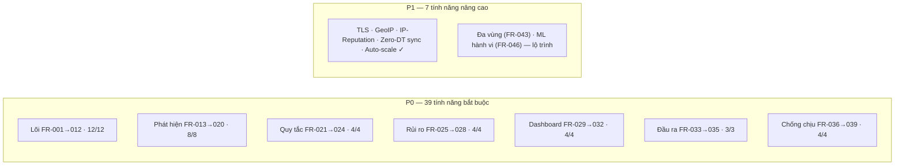
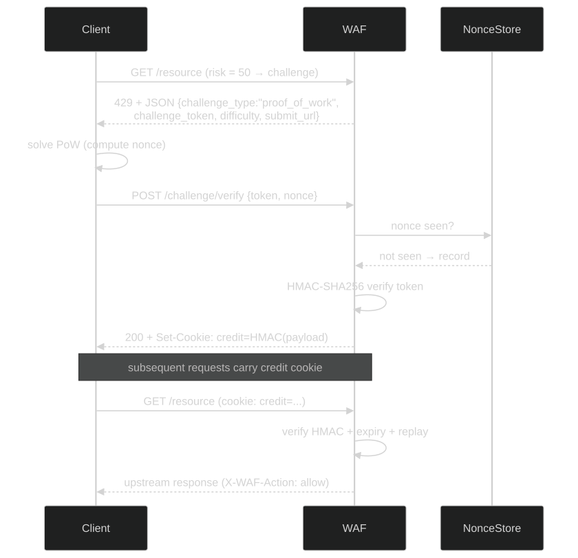
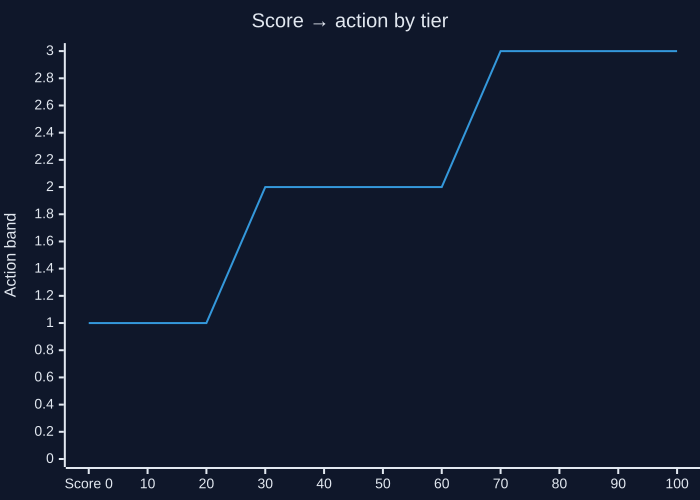
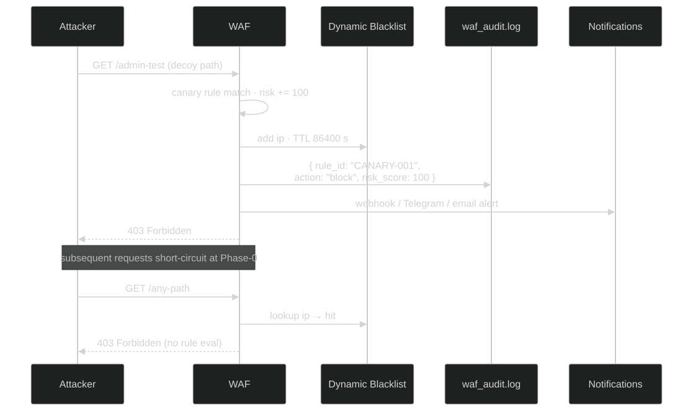
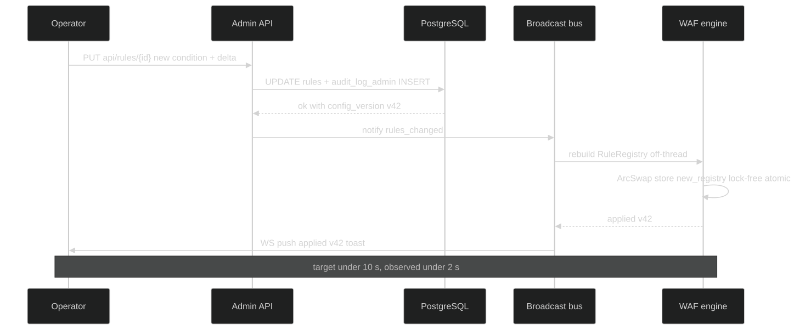
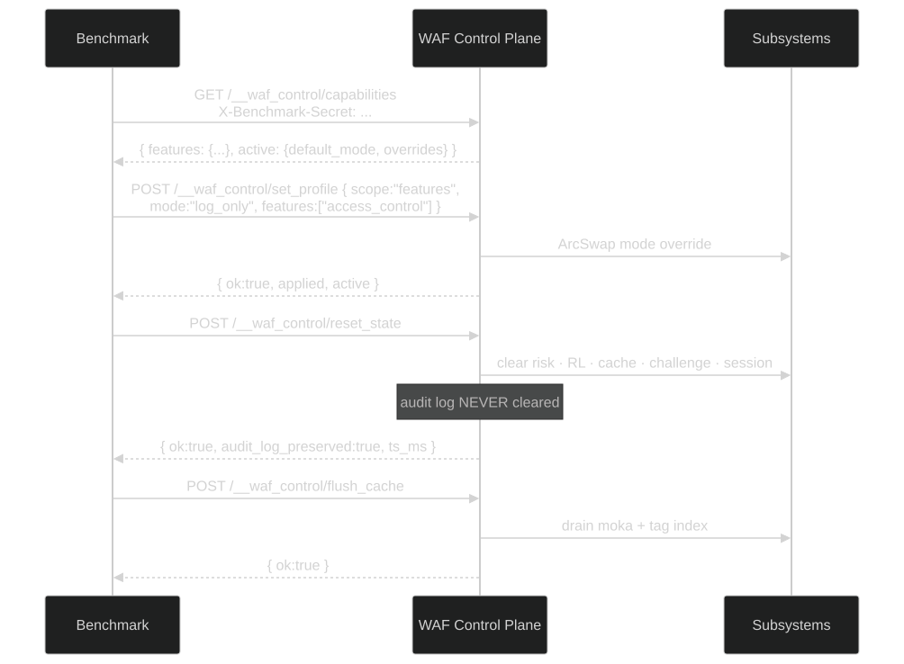

# F&G WAF — 46 Tính Năng Chi Tiết (Bản Kỹ Thuật Mở Rộng)

> **Tài liệu đồng hành** của [Hướng Dẫn Toàn Diện (Bản Dễ Hiểu)](./PRX-WAF-TechnicalGuide-VI.md).
>
> 📘 Nếu bạn **mới tìm hiểu**, hãy đọc bản *Dễ Hiểu* trước (có phần "WAF là gì?" và Bảng Thuật Ngữ). Tài liệu này đi **sâu vào từng tính năng** trong số **46 yêu cầu chức năng (FR-001 → FR-046)**, kèm sơ đồ chi tiết. Mỗi mục vẫn có một đoạn *"Nói đơn giản"* để người không chuyên nắm được ý chính.
>
> 🔖 Các thuật ngữ (SQLi, XSS, JA3, token-bucket…) được giải thích trong [Bảng Thuật Ngữ của bản Dễ Hiểu](./PRX-WAF-TechnicalGuide-VI.md#-bảng-thuật-ngữ-tra-cứu-nhanh).

---

## Mục Lục

1. [Sứ Mệnh & Phạm Vi Tính Năng](#1-sứ-mệnh--phạm-vi-tính-năng)
2. [Kiến Trúc & Vòng Đời Một Request](#2-kiến-trúc--vòng-đời-một-request)
3. [Nhóm Lõi — FR-001 → FR-012](#3-nhóm-lõi--fr-001--fr-012)
4. [Nhóm Phát Hiện Tấn Công — FR-013 → FR-020](#4-nhóm-phát-hiện-tấn-công--fr-013--fr-020)
5. [Nhóm Hệ Thống Quy Tắc — FR-021 → FR-024](#5-nhóm-hệ-thống-quy-tắc--fr-021--fr-024)
6. [Nhóm Bộ Máy Rủi Ro — FR-025 → FR-028](#6-nhóm-bộ-máy-rủi-ro--fr-025--fr-028)
7. [Nhóm Bảng Điều Khiển — FR-029 → FR-032](#7-nhóm-bảng-điều-khiển--fr-029--fr-032)
8. [Nhóm Lọc Đầu Ra — FR-033 → FR-035](#8-nhóm-lọc-đầu-ra--fr-033--fr-035)
9. [Nhóm Chống Chịu — FR-036 → FR-039](#9-nhóm-chống-chịu--fr-036--fr-039)
10. [Nhóm Mở Rộng — FR-040 → FR-046](#10-nhóm-mở-rộng--fr-040--fr-046)
11. [Hợp Đồng Tích Hợp (Interop Contract)](#11-hợp-đồng-tích-hợp-interop-contract)
12. [Ma Trận Phòng Thủ 8 Hướng Tấn Công](#12-ma-trận-phòng-thủ-8-hướng-tấn-công)
13. [Hiệu Năng & Yêu Cầu Phi Chức Năng (NFR)](#13-hiệu-năng--yêu-cầu-phi-chức-năng-nfr)
14. [Tình Huống Thực Tế](#14-tình-huống-thực-tế)
15. [Giới Hạn Trung Thực](#15-giới-hạn-trung-thực)
16. [Bản Đồ FR → Kiến Trúc](#16-bản-đồ-fr--kiến-trúc)

> ℹ️ **Lưu ý về số liệu:** Tài liệu này được biên soạn lại (sang tiếng Việt, dễ hiểu) từ bộ tài liệu thuyết trình nội bộ phiên bản 2.5. Một số con số đã được **đối chiếu lại với mã nguồn nhánh `main` hiện tại** và cập nhật cho đúng (ví dụ: giao diện hiện có 3 ngôn ngữ en/vi/zh và hơn 30 trang quản trị; tổng quy tắc hơn 650 — xem Mục 6 của bản Dễ Hiểu). Các số liệu hiệu năng (độ trễ, thông lượng) là **kết quả benchmark do nhóm phát triển báo cáo**, không phải cam kết tuyệt đối cho mọi môi trường.

---

## 1. Sứ Mệnh & Phạm Vi Tính Năng

> **Nói đơn giản:** Mục tiêu của WAF là *bảo vệ máy chủ phía sau mà không trở thành lý do khiến hệ thống chậm đi, hỏng, hoặc sập*. Bảo vệ tốt — nhưng phải nhẹ và ổn định.

Ba mục tiêu cốt lõi:

| Mục tiêu | Nghĩa là gì | Cách đạt được |
|----------|-------------|----------------|
| **Hiệu quả an ninh** | Nhận diện & xử lý request nguy hiểm (OWASP + bot + gian lận + DDoS) | Dây chuyền 16 phase · chấm điểm rủi ro tích luỹ · vân tay + hành vi + vận tốc |
| **Ít báo nhầm (false positive)** | Không chặn nhầm khách thật, không phá luồng nghiệp vụ | Chính sách theo tầng · bộ phát hiện chất lượng libinjection · fail-open cho lưu lượng thường |
| **Chất lượng vận hành** | Quan sát rõ ràng, log đầy đủ, ổn định, dễ dùng | Luồng WebSocket trực tiếp · log JSON · nạp nóng từ UI · một file chạy |

**Bảng điểm phạm vi (theo báo cáo của nhóm phát triển):**


```mermaid
flowchart LR
    subgraph P0["P0 — 39 tính năng bắt buộc"]
        C["Lõi FR-001→012 · 12/12"]
        D["Phát hiện FR-013→020 · 8/8"]
        R["Quy tắc FR-021→024 · 4/4"]
        RK["Rủi ro FR-025→028 · 4/4"]
        DB["Dashboard FR-029→032 · 4/4"]
        O["Đầu ra FR-033→035 · 3/3"]
        RES["Chống chịu FR-036→039 · 4/4"]
    end
    subgraph P1["P1 — 7 tính năng nâng cao"]
        T["TLS · GeoIP · IP-Reputation · Zero-DT sync · Auto-scale ✓"]
        TODO["Đa vùng (FR-043) · ML hành vi (FR-046) — lộ trình"]
    end
```

- **39/39 P0** đã hoàn thành.
- **5/7 P1** đã hoàn thành; **2/7** (đa vùng FR-043, ML hành vi FR-046) nằm trong lộ trình tương lai (xem [Mục 15](#15-giới-hạn-trung-thực)).

---

## 2. Kiến Trúc & Vòng Đời Một Request

### 2.1 Một file chạy, hai "mặt tiền"

> **Nói đơn giản:** Toàn bộ WAF gói trong **một file `waf`**. File này vừa làm *proxy* (xử lý lưu lượng khách), vừa phục vụ *trang quản trị* — không cần chạy thêm tiến trình phụ nào.


*Sơ đồ 1 — Một file chạy, hai mặt tiền (proxy + dashboard)*

- **Lõi Rust, một file** — khởi động bằng `./waf run`, không phụ thuộc runtime ngoài.
- **Kiểm tra hai chiều** — lọc cả request *vào* lẫn response *ra*.
- **Dashboard + control plane nhúng sẵn** — không sidecar, không tiến trình phụ.

### 2.2 Vòng đời end-to-end


*Sơ đồ 2 — Hành trình một request từ lúc đến tới lúc trả lời*

| Bước | Tính năng | Kết quả tạo ra |
|------|-----------|----------------|
| 1. Phát hiện relay | FR-007 | `ClientIdentity` (IP thật, loại ASN, tín hiệu) |
| 2. Phân loại tầng | FR-002 | Chính sách tầng (fail-mode, ngưỡng DDoS, cache, ngưỡng rủi ro) |
| 3. Cổng Phase-0 | FR-008 | Quyết định truy cập (chặn sớm nếu khớp) |
| 4. Dây chuyền 16 phase | FR-003,004,005,011,012,013–020 | Tín hiệu + điểm rủi ro cộng thêm |
| 5. Cổng rủi ro | FR-025–028 | Quyết định: cho qua / thách thức / chặn |
| 6. Lọc đầu ra | FR-033–035 | Response đã làm sạch + một dòng log |

> Mọi cấu hình "hoán đổi nóng" bằng thao tác nguyên tử không khoá — **không cần khởi động lại dịch vụ**.

### 2.3 Toàn cảnh dây chuyền 16 phase


*Sơ đồ 3 — Chi tiết 16 phase kiểm tra (xem bản Dễ Hiểu Mục 5 để có phiên bản giải thích từng bước)*

> Mỗi phase phát ra **tín hiệu + điểm rủi ro**. Kể cả khi một phase "cho qua", nó vẫn có thể cộng +20 điểm rủi ro mà cổng quyết định cuối cùng sẽ gộp lại.

---

## 3. Nhóm Lõi — FR-001 → FR-012

### FR-001 — Reverse Proxy (Proxy trung gian) · FR-002 — Bảo Vệ Theo Tầng

> **Nói đơn giản:** FR-001 = chuyển tiếp trung thực lưu lượng tới máy chủ thật. FR-002 = chia đường dẫn thành 4 mức quan trọng để áp mức bảo vệ khác nhau.


*Sơ đồ 4 — Bộ phân loại tầng và chính sách từng tầng*

- **FR-001:** Hỗ trợ HTTP/1.1, HTTP/2, HTTP/3 (QUIC); cân bằng tải round-robin theo trọng số; health check backend; chọn ALPN theo host (`h2h1`/`h1_only`/`h2_only`). Method, header, body được **chuyển tiếp không bóp méo**.
- **FR-002:** Phân loại theo điều kiện path (`exact`/`prefix`/`regex`), hậu tố host, method, header — kết hợp bằng **VÀ**. Sắp xếp theo độ ưu tiên (số nhỏ chạy trước). Hoán đổi nóng bằng cấu hình nguyên tử. (Xem 4 tầng Critical/High/Medium/CatchAll ở [bản Dễ Hiểu Mục 2.3](./PRX-WAF-TechnicalGuide-VI.md#23-bốn-tầng-ưu-tiên-tier--fr-002).)

### FR-003 — Bộ Máy Quy Tắc

> **Nói đơn giản:** Cho phép định nghĩa "điều luật" tuỳ ý — khớp theo IP, đường dẫn, header, nội dung, cookie — và kết hợp bằng logic VÀ/HOẶC/KHÔNG.


*Sơ đồ 5 — Cây quy tắc đã biên dịch + bộ lọc phạm vi*

- Khớp theo: **IP · Path · Header · Payload · Cookie · query**.
- Kết hợp luận lý · ưu tiên dạng số · mỗi quy tắc cộng một lượng điểm rủi ro.
- Nguồn: file `rules/*.yaml` (theo dõi thay đổi file) **+** cơ sở dữ liệu (thêm/sửa qua UI).
- **Cô lập lỗi từng file** — một quy tắc hỏng không làm sập cả bộ máy.

### FR-004 — Giới Hạn Tần Suất

> **Nói đơn giản:** Mỗi nguồn chỉ được gửi tối đa X request trong Y giây. Vượt quá thì bị chặn.


*Sơ đồ 6 — Hai khoá: theo IP và theo phiên; mỗi khoá có token-bucket + cửa sổ trượt*

- Hai khoá kiểm tra: `ip:host:client_ip` rồi `sess:host:session_id`.
- Cơ chế **token-bucket (cho phép bùng) + cửa sổ trượt (giới hạn về dài)**.
- Bộ nhớ: **RAM** (giới hạn 100 nghìn mục, dọn sau 10 phút nhàn rỗi) **hoặc Redis/Valkey** (script Lua, timeout 50 ms). Có **circuit-breaker**: Redis lỗi 5 lần → tự chuyển về RAM.

### FR-005 — Chống DDoS

> **Nói đơn giản:** Phát hiện khi một nguồn (hoặc cả mạng botnet) dội request bất thường, rồi cấm tạm thời.


*Sơ đồ 7 — Ba bộ dò song song: theo IP, theo vân tay, theo tầng*

- Trước tiên kiểm tra **bảng cấm** (đã bị cấm → chặn ngay 403).
- Ba bộ dò chạy song song: **theo IP**, **theo vân tay** (botnet trải nhiều IP), **theo tầng** (RPS thích ứng).
- Hành động khi vượt ngưỡng: **Cấm** (bảng IP, TTL ~60 giây) · **Cộng điểm rủi ro** · **Suy giảm** (tuỳ fail-mode của tầng).
- Bộ nhớ: RAM (DashMap) hoặc Redis; có circuit-breaker dự phòng.

### FR-006 — Bộ Máy Thách Thức (Challenge)

> **Nói đơn giản:** Với khách "hơi đáng ngờ", thay vì chặn thẳng, WAF bắt trình duyệt *giải một câu đố* (proof-of-work). Người thật vượt qua dễ dàng; bot thì tốn kém.


*Sơ đồ 8 — Trình tự: phát câu đố → client giải → xác minh → cấp "vé tín nhiệm"*

- "Vé tín nhiệm" ký bằng **HMAC-SHA256** · khoá bí mật 32 byte · file quyền 0600.
- **Chống phát lại (replay)** bằng `NonceStore` (LRU): nonce dùng rồi không dùng lại được.
- Hai định dạng: **câu đố JSON** và **câu đố HTML**.

### FR-007 — Phát Hiện Relay & Proxy

> **Nói đơn giản:** Tìm ra *IP thật* của khách dù họ đi qua nhiều lớp proxy, và nhận diện nếu họ đến từ trung tâm dữ liệu hay mạng ẩn danh Tor.


*Sơ đồ 9 — Phân tích chuỗi X-Forwarded-For, phân loại ASN, đối chiếu Tor*

- Đọc header `X-Forwarded-For` / `X-Real-IP`, kiểm tra chuỗi proxy (chặn giả mạo IP nội bộ, chuỗi quá dài > 32 hop).
- Phân loại **ASN**: trung tâm dữ liệu / nhà dân / Tor. Danh sách Tor làm mới mỗi giờ.
- ⚠️ **Quan trọng:** trường `ip` trong log an ninh **luôn là địa chỉ TCP thật (peer_addr)** — XFF chỉ là thông tin bổ sung. Điều này tránh kẻ tấn công "khai man" IP qua header.

### FR-008 — Danh Sách Trắng + Đen (Cổng Phase-0)

> **Nói đơn giản:** Trạm gác đầu tiên. Chặn ngay những host/IP không hợp lệ, trước khi tốn công kiểm tra sâu.


*Sơ đồ 10 — Thứ tự: cổng host → IP đen → IP trắng*

- Dùng **cây Patricia** (tra cứu dải IP cực nhanh), hỗ trợ cả IPv4 lẫn IPv6.
- Nguồn: `rules/access-lists.yaml` + nguồn tình báo (Tor, ASN xấu).
- **Chế độ dry-run:** quyết định chặn được ghi log nhưng *không thực thi* — để thử an toàn.
- 🔑 **Đen trước, trắng sau:** nếu một IP trong danh sách trắng bị lộ/đánh cắp, nó vẫn không thể vượt qua lệnh chặn rõ ràng.

### FR-009 — Cache Thông Minh

> **Nói đơn giản:** Lưu tạm các câu trả lời hay dùng để phản hồi nhanh hơn — nhưng *không bao giờ* cache nội dung nhạy cảm (trang đăng nhập, dữ liệu cá nhân).


*Sơ đồ 11 — Chuỗi cổng quyết định có nên cache không*

| Tầng | Hành vi cache | Header `X-WAF-Cache` |
|------|---------------|----------------------|
| **Critical** | Không bao giờ cache (nhạy cảm) | `BYPASS` |
| **High** | TTL ngắn, bỏ qua nếu có auth | `BYPASS`/`MISS`/`HIT` |
| **Medium** | TTL bình thường, tôn trọng `Cache-Control` | `MISS`/`HIT` |
| **CatchAll** | Cache mạnh, hợp với tài nguyên tĩnh | `MISS`/`HIT` |

### FR-010 — Vân Tay Thiết Bị (Device Fingerprinting)

> **Nói đơn giản:** Tạo "vân tay" cho mỗi trình duyệt/công cụ dựa trên cách nó bắt tay TLS và HTTP/2. Nhờ đó nhận ra cùng một kẻ tấn công kể cả khi nó liên tục đổi IP.


*Sơ đồ 12 — Tạo JA3/JA4 + Akamai H2 hash, theo dõi qua nhiều IP/UA*

- **Đổi IP liên tục** với cùng một vân tay → tín hiệu `IpHopping` (nhảy IP).
- **Khai man trình duyệt** (cùng vân tay nhưng lúc khai Chrome lúc Safari) → tín hiệu `FpConflict` (mâu thuẫn vân tay).
- Hoán đổi nóng cấu hình kho danh tính, theo dõi file ≤ 1 giây.

### FR-011 — Phát Hiện Bất Thường Hành Vi

> **Nói đơn giản:** Người thật bấm chuột có nhịp ngẫu nhiên; bot thì gõ đều như máy. WAF đo "nhịp" để phân biệt.


*Sơ đồ 13 — Bộ đệm vòng 16 ô ghi nhịp request, phân tích đều đặn/độ sâu/referer*

| Tín hiệu | Ngưỡng | Điểm cộng (mặc định) |
|----------|--------|----------------------|
| `BotTiming` (gõ quá nhanh) | khoảng cách request < 50 ms | +15 |
| `Regular` (đều như máy) | độ lệch chuẩn / trung bình < 0.1 | +10 |
| `ZeroDepth` (chỉ ở trang vào) | không bao giờ đi sâu hơn trang đầu | +12 |
| `NoReferer` (thiếu nguồn) | thiếu Referer ở trang không phải trang vào | +8 |

### FR-012 — Vận Tốc & Trình Tự Giao Dịch

> **Nói đơn giản:** Phát hiện gian lận tài chính dựa trên *trình tự bất thường* — ví dụ rút tiền mà chưa qua bước OTP, hoặc hoàn tất chuỗi quá nhanh như máy.


*Sơ đồ 14 — Máy trạng thái trình tự (Anonymous → Login → OTP → Deposit/Withdraw)*


*Sơ đồ 15 — Gắn nhãn vai trò endpoint + ba bộ phân loại vận tốc*

- `sequence_timing`: kiểm tra đúng thứ tự Login → OTP → Rút tiền.
- `withdrawal_velocity`: rút tiền dồn dập trong thời gian ngắn.
- `limit_change_burst`: đổi hạn mức rồi rút ngay.
- **Chỉ phát tín hiệu** (+25..+30 điểm rủi ro) — quyết định cuối thuộc về bộ chấm điểm rủi ro.

---

## 4. Nhóm Phát Hiện Tấn Công — FR-013 → FR-020

### FR-013 SQL Injection · FR-014 XSS

> **Nói đơn giản:** Bắt hai loại tấn công phổ biến nhất: chèn câu lệnh cơ sở dữ liệu (SQLi) và chèn mã JavaScript độc (XSS) — kể cả khi kẻ tấn công mã hoá payload nhiều lớp để né.


*Sơ đồ 16 — Chuẩn hoá → giải mã URL 3 vòng → trích bề mặt → libinjection + 19 mẫu*

- **FR-013 (SQLi):** dùng **libinjection** (bộ phát hiện đã được kiểm chứng, ít báo nhầm) + **bộ 19 mẫu** (`SQLI-001..019`) + 3 bộ quét (classic/blind/error-based). Quét trên query, path, cookie, header, body JSON/form. **Giải mã URL lặp 3 vòng** để chống né bằng mã hoá.
- **FR-014 (XSS):** libinjection cho XSS + regex dự phòng cho các mẫu HTML/JS/`javascript:`. Hoạt động trên dữ liệu *đã chuẩn hoá + giải mã*.

### FR-015 Traversal · FR-016 SSRF · FR-017 Header Injection

> **Nói đơn giản:** Chặn ba kiểu: leo thư mục (`../`) để đọc file cấm; lừa máy chủ tự gọi địa chỉ nội bộ; và chèn ký tự xuống dòng vào header để "tách" phản hồi.


*Sơ đồ 17 — Chuẩn hoá path, chặn dải nội bộ RFC-1918, kiểm tra CRLF & Host*

- **FR-015 (Traversal):** chuẩn hoá + canonical hoá path, giải mã URL 3 vòng (chống `%252e%252e%252f`), phát hiện null-byte, dấu phân cách Windows, UTF-8 overlong.
- **FR-016 (SSRF):** bộ kiểm URL có **chống DNS rebinding** (phân giải tại thời điểm kiểm và khoá IP); chặn dải RFC-1918 + link-local + loopback; chặn endpoint metadata đám mây (`169.254.169.254`, GCP, Azure). Nguồn quy tắc từ xa cũng phải qua bộ kiểm SSRF (chỉ IP công khai, không theo redirect).
- **FR-017 (Header Injection):** kiểm `Host` chặt theo bản đồ vhost; phát hiện CRLF (`\r\n`) trong header → chặn; phát hiện giả mạo XFF (qua FR-007).

### FR-018 Brute Force · FR-019 Recon · FR-020 Body Abuse

> **Nói đơn giản:** FR-018 chặn dò mật khẩu; FR-019 chặn dò quét/liệt kê endpoint; FR-020 chặn body dị dạng/quá lớn/lồng quá sâu.

- **FR-018:** giới hạn theo phiên (`RL-SESSION`) + đếm đăng nhập thất bại → cộng điểm rủi ro → thách thức khi vượt ngưỡng.
- **FR-019:** module nhận diện scanner (vân tay công cụ) + nhận diện bot (UA + dấu hiệu headless) + mẫu bùng nổ lỗi 4xx/5xx → cộng điểm rủi ro; OPTIONS bị giới hạn theo tầng.
- **FR-020:** giới hạn độ dài body theo tầng; đối chiếu content-type với độ dài khai báo; giới hạn độ sâu/độ dài mảng khi phân tích JSON.

---

## 5. Nhóm Hệ Thống Quy Tắc — FR-021 → FR-024

> **Nói đơn giản:** Có thể thêm/sửa/xoá quy tắc *mà không cần build lại hay khởi động lại*; quy tắc viết bằng YAML dễ đọc; có thể giới hạn phạm vi áp dụng và đặt thứ tự ưu tiên rõ ràng.

### FR-021 — Nạp Nóng (Hot-reload)

| Nguồn | Cơ chế kích hoạt | Độ trễ |
|-------|------------------|--------|
| `rules/*.yaml` (file) | theo dõi file + `SIGHUP` | hoán đổi registry nguyên tử |
| `rules/custom/*.yaml` | notify + DB | gộp 500 ms, cô lập lỗi từng file |
| Thao tác trên Dashboard | API → DB → broadcast | **≤ 10 giây** (giới hạn hợp đồng) |
| Danh sách truy cập | notify + `SIGHUP` | gộp 250 ms |
| Rate / DDoS / cache / risk / relay | notify | gộp 200–500 ms |

### FR-022 — Định Dạng Quy Tắc YAML

```yaml
id: SQLI-OR-1EQ1
description: "Tiêm boolean kiểu OR 1=1"
condition: { all: [ { field: query, op: regex, value: "(?i)or\\s+1=1" } ] }
action: block
risk_score_delta: 40
priority: 100
scope: { tier: [critical, high], route: "/api/*" }
```

### FR-023 — Phạm Vi (Scoping)
Toàn cục · theo tầng · theo route · theo IP · theo phiên · theo vân tay.

### FR-024 — Ưu Tiên (Priority)
Dạng số, **số nhỏ chạy trước**; giải quyết xung đột một cách xác định (deterministic).

---

## 6. Nhóm Bộ Máy Rủi Ro — FR-025 → FR-028

### FR-025 — Chấm Điểm Rủi Ro Tích Luỹ

> **Nói đơn giản:** Thay vì phán "tốt/xấu" cho từng dấu hiệu, WAF *cộng dồn điểm nghi ngờ* cho mỗi người truy cập (theo IP, theo vân tay, theo phiên). Đủ cao thì thách thức hoặc chặn.


*Sơ đồ 18 — Toàn cảnh: đầu vào → L0 seed → L1 tích luỹ (3 chỉ mục) → L2 hành vi/vận tốc → cổng ngưỡng*

- **Chỉ mục ba lớp** (`ip` / `fp` / `session`) với quy tắc "gộp khi trùng" (lấy max, hợp nhất nguồn đóng góp).
- **Bộ nhớ:** RAM (một node) hoặc Redis (nhiều node, Lua nguyên tử, có circuit-breaker).
- **Dọn theo tuổi trạng thái:** mặc định 3600 giây.
- **Phát header `X-WAF-Risk-Score: 0–100`** trên *mọi* phản hồi.

### FR-026 — Động Lực Điểm Rủi Ro

> **Nói đơn giản:** Điểm *tăng* khi có dấu hiệu xấu, và *giảm dần* khi hành xử sạch — giống điểm tín nhiệm.


*Sơ đồ 19 — Yếu tố làm tăng (+) và giảm (−) điểm*

- **Tăng (+):** khớp quy tắc (0–50), thách thức thất bại (15), bất thường hành vi (5–20), ASN đáng ngờ (10–25), mâu thuẫn vân tay (15), DDoS (5–30), bất thường vận tốc giao dịch (25–30).
- **Giảm (−):** vượt thách thức (reset một phần), chuỗi sạch (giảm tuyến tính 1 điểm/phút), nhàn rỗi quá hạn TTL (3600 giây) → xoá.

### FR-027 — Ngưỡng Quyết Định (theo tầng)


*Sơ đồ 20 — Điểm → hành động theo tầng*

```yaml
# Mặc định toàn cục
allow_threshold:     30   # < 30  → Cho qua
challenge_threshold: 70   # 30..70 → Thách thức · ≥ 70 → Chặn

# Ví dụ ghi đè cho tầng Critical (nhạy hơn)
[tiers.critical.risk_thresholds]
allow_threshold:     15
challenge_threshold: 50
```

### FR-028 — Bẫy Mật Ong (Canary / Honeypot)

> **Nói đơn giản:** Đặt các đường dẫn "mồi" mà người dùng thật không bao giờ vào (như `/.env`, `/wp-admin`). Ai chạm vào gần như chắc chắn là kẻ dò quét → đẩy điểm lên kịch trần và cấm IP.


*Sơ đồ 21 — Chạm bẫy → risk += 100 → cấm IP 24h → cảnh báo → các request sau bị chặn tại Phase-0*

```yaml
- id: CANARY-001
  scope: { route: ["/admin-test","/api-debug","/.env","/wp-admin","/phpmyadmin"] }
  action: block
  risk_score_delta: 100              # vào ngay dải chặn
  extra:
    blacklist_ip_ttl_secs: 86400     # tự cấm 24 giờ
    notify: ["telegram","webhook"]
```

---

## 7. Nhóm Bảng Điều Khiển — FR-029 → FR-032

### FR-029 Luồng Trực Tiếp · FR-030 Trực Quan Hoá Tấn Công

> **Nói đơn giản:** Mọi quyết định của WAF hiện lên dashboard *gần như tức thì* (dưới 1 giây) qua WebSocket, kèm biểu đồ phân loại tấn công, top IP, bản đồ nhiệt theo endpoint và theo quốc gia.


*Sơ đồ 22 — Bus phát tán sự kiện → WebSocket → các biểu đồ dashboard*

- WebSocket `/ws/events` (mọi quyết định) và `/ws/logs` (log thô).
- Mỗi sự kiện gồm: `request_id, ts_ms, ip, method, path, action, risk_score, rule_id, tier, mode`.
- **Mục tiêu độ trễ ≤ 5 giây** từ lúc quyết định tới lúc hiển thị — thực tế dưới 1 giây.

### FR-031 Cấu Hình Nóng · FR-032 Log Kiểm Toán Có Cấu Trúc


*Sơ đồ 23 — Lưu trên UI → DB → broadcast → bộ máy nạp lại nguyên tử (< 2 giây)*

- **FR-031:** Hơn 30 trang quản trị; cập nhật quy tắc/ngưỡng/hành động không cần khởi động lại; có chỉ báo "đã áp dụng" kèm số phiên bản cấu hình. Mục tiêu UI-Lưu → hiệu lực ≤ 10 giây (quan sát < 2 giây).
- **FR-032:** Mỗi request ghi một dòng JSON (JSONL), chỉ-ghi-thêm (append-only), sẵn sàng nạp vào Splunk / ELK / Loki:

```json
{ "request_id":"...", "ts_ms":1735045200123, "ip":"203.0.113.5",
  "device_fp":"ja4=...", "tier":"critical", "method":"POST", "path":"/login",
  "risk_score":85, "rule_id":"SQLI-OR-1EQ1", "action":"block", "mode":"enforce",
  "access_decision":"continue", "asn":15169, "asn_class":"datacenter",
  "x_waf_cache":"miss", "host":"api.example.com" }
```

---

## 8. Nhóm Lọc Đầu Ra — FR-033 → FR-035

> **Nói đơn giản:** WAF không chỉ lọc cái *đi vào*, mà còn lọc cái *đi ra* — chặn lộ vết lỗi, che dữ liệu nhạy cảm, và gỡ các header tiết lộ công nghệ máy chủ.


*Sơ đồ 24 — Giải nén gzip → lọc header → quét body / che trường JSON*

- **FR-033 (Quét body):** chặn stack-trace (Java/Python/Node/Rust), IP nội bộ RFC-1918, JWT, khoá AWS/GCP/Azure, thông điệp lỗi SQL dài dòng. Có giải nén gzip để quét. Mở rộng qua `rules/outbound.yaml`.
- **FR-034 (Che trường):** che các trường JSON như `password`, `token`, `secret`, `api_key`, `card_number`, `bank_account`, `cvv`, `pin` → thay bằng `"***"`, giữ nguyên cấu trúc. Có thể thêm trường theo host/route.
- **FR-035 (Gỡ header lộ thông tin):** gỡ `Server`, `X-Powered-By`, `X-AspNet-Version`, `X-Runtime`… và các tiền tố `X-Debug-*`, `X-Internal-*`, `X-Trace-*`. **Không bao giờ** gỡ header bảo mật (HSTS, CSP, X-Frame-Options). Tham chiếu chuẩn: OWASP ASVS V14.4, CWE-200/209, NIST SP 800-53 SI-11.

---

## 9. Nhóm Chống Chịu — FR-036 → FR-039

> **Nói đơn giản:** Khi có trục trặc nội bộ, WAF xử lý "an toàn theo bối cảnh": tầng quan trọng thì chặn (an toàn), tầng thường thì cho qua (không gián đoạn). Backend chết thì "ngắt mạch" để không kéo theo cả hệ thống.


*Sơ đồ 25 — Lỗi nội bộ → theo fail-mode của tầng: chặn (Critical/High) hoặc cho qua (Medium/CatchAll)*


*Sơ đồ 26 — Máy trạng thái ngắt mạch: Closed → Open → HalfOpen*

- **FR-036/037/038 (Fail-mode theo tầng):** Critical/High = **fail-close** (chặn); Medium/CatchAll = **fail-open** (cho qua + ghi cảnh báo).
- **FR-039 (Circuit Breaker — Ngắt mạch):**

| Hệ thống con | Đối tượng ngắt | Hành vi khi "Open" |
|--------------|----------------|--------------------|
| **Upstream** | backend mất kết nối | trả `503` · `X-WAF-Action: circuit_breaker` |
| **Redis** (FR-004/005/025) | script Lua lỗi | chuyển sang LRU trong RAM (10 nghìn mục) |
| **Nguồn tình báo** (FR-042) | tải HTTP lỗi | giữ bản snapshot tốt gần nhất · thử lại có backoff |

Tự đóng lại (re-close) khi thành công · không cần khôi phục thủ công.

---

## 10. Nhóm Mở Rộng — FR-040 → FR-046

### FR-040 — TLS / HTTPS
- Kết thúc TLS 1.2/1.3 theo host; ALPN upstream theo host; tuỳ chọn mTLS với upstream; tự động Let's Encrypt (ACME v2) qua `instant-acme` kèm tự gia hạn.

### FR-041 — GeoIP
- CSDL GeoIP `ip2region` đóng gói sẵn (tra offline, p99 < 10 ms); chặn/thách thức theo mã quốc gia ISO; phát hiện VPN/trung tâm dữ liệu (kết hợp ASN của FR-007); bản đồ nhiệt địa lý trên dashboard.

### FR-042 — Danh Tiếng IP (IP Reputation)
- Danh sách Tor exit (làm mới HTTP có ETag, mỗi giờ, hoán đổi nguyên tử); danh sách ASN xấu (file + ghi đè của người vận hành); khớp → **+25 điểm rủi ro** (cấu hình được); nạp nóng qua theo dõi file.

### FR-043 → FR-046 — Trạng thái

| Mã | Yêu cầu | Trạng thái | Ghi chú |
|----|---------|------------|---------|
| **FR-043** | Triển khai đa vùng | 🟡 *Lộ trình* | Cluster hiện hoạt động trong **một mạng LAN**; liên-trung-tâm-dữ-liệu nằm trong lộ trình |
| **FR-044** | Đồng bộ cấu hình không gián đoạn | ✅ Xong | Đồng bộ quy tắc cluster: changelog tăng dần + snapshot đầy đủ (nén lz4) |
| **FR-045** | Tự co giãn (auto-scaling) | 🟢 Một phần | Trạng thái chia sẻ qua Redis cho rủi ro & rate; mở rộng ngang được; bầu vai trò `auto` |
| **FR-046** | Chấm điểm bằng ML hành vi | 🟡 *Lộ trình* | Hiện dùng heuristic quy tắc + tín hiệu (chưa có mô hình ML) |

> **Chấm điểm trung thực:** nhóm phát triển chỉ tuyên bố những gì thực sự có. ML là "rủi ro cao, lợi ích thấp" cho một kỳ hackathon — heuristic cho hành vi xác định và dễ gỡ lỗi khi bị Red Team tấn công.

---

## 11. Hợp Đồng Tích Hợp (Interop Contract)

> **Nói đơn giản:** Đây là "bộ quy ước" để hệ thống chấm điểm hackathon (và các công cụ giám sát) có thể *giao tiếp chuẩn* với WAF: mỗi phản hồi gắn header chuẩn, có một cổng điều khiển riêng, một file log chuẩn, và một bộ "lớp quyết định" thống nhất.

### 11.1 §5 — Header quan sát bắt buộc

Mọi phản hồi (cho qua / chặn / thách thức / giới hạn / timeout / ngắt mạch) đều gắn:

| Header | Định dạng | Nguồn |
|--------|-----------|-------|
| `X-WAF-Request-Id` | UUID v4 | khớp với `request_id` trong audit log |
| `X-WAF-Risk-Score` | số 0–100 | đầu ra bộ chấm điểm FR-025 |
| `X-WAF-Action` | `allow`/`block`/`challenge`/`rate_limit`/`timeout`/`circuit_breaker` | quyết định cuối |
| `X-WAF-Rule-Id` | mã quy tắc, hoặc `none` | quy tắc/chính sách gây ra quyết định |
| `X-WAF-Cache` | `HIT`/`MISS`/`BYPASS` | kết quả cache FR-009 |
| `X-WAF-Mode` | `enforce`/`log_only` | chế độ của chính sách |


*Sơ đồ 27 — Mỗi quyết định gắn 6 header X-WAF + ghi audit log*

### 11.2 §2 — Control Plane (`/__waf_control`)


*Sơ đồ 28 — Trình tự: lấy capabilities → đặt profile → reset state → flush cache*

- **Xác thực** bằng header bí mật `X-Benchmark-Secret: <bí-mật-cấu-hình>` (sai/thiếu → 403).
- **Chỉ cục bộ** — không bao giờ chuyển tiếp tới upstream.
- **Reset nguyên tử** — đồng bộ, không để lộ trạng thái dở dang.
- **Log kiểm toán được giữ nguyên** qua mọi lần reset (chỉ-ghi-thêm).

> 🔒 *Lưu ý bảo mật:* giá trị bí mật thực của header này nằm trong cấu hình triển khai — **không in vào tài liệu công khai**.

### 11.3 §6 — Audit Log (`./waf_audit.log`, định dạng JSONL)


*Sơ đồ 29 — Mỗi quyết định → một dòng JSON chỉ-ghi-thêm → sẵn sàng cho SIEM*

- Trường bắt buộc: `request_id, ts_ms, ip, method, path, action, risk_score, mode`.
- Trường mở rộng (bonus): `tier, device_fp, asn, asn_class, rule_id, access_decision, signals[]`.
- ⚠️ Trường `ip` là **địa chỉ TCP thật (peer_addr)**, *không phải* XFF.

### 11.4 §3 — Lớp quyết định & ánh xạ mối đe doạ


*Sơ đồ 30 — 6 lớp quyết định: allow / block / challenge / rate_limit / timeout / circuit_breaker*

| Loại mối đe doạ | Hành động hợp lệ | Đường phòng thủ |
|-----------------|------------------|-----------------|
| Tiêm độ tin cậy cao (SQLi/XSS/CMDi/SSRF) | block, challenge | FR-013–017 |
| Lạm dụng đăng nhập (brute-force, stuffing) | rate_limit, challenge, block | FR-004 → FR-006 → block |
| Tấn công khối lượng một nguồn | rate_limit, block | FR-005 → bảng cấm |
| Slow-loris / cạn kết nối | timeout, block | timeout upstream + giới hạn kết nối |
| Upstream suy giảm | circuit_breaker | FR-039 → 503 |
| Dò quét / recon | block, rate_limit, challenge | FR-028 canary + FR-019 scanner |
| IP độc đã biết | block | FR-008 blacklist + FR-042 tình báo |

---

## 12. Ma Trận Phòng Thủ 8 Hướng Tấn Công

> **Nói đơn giản:** Mỗi hướng tấn công đều có **ít nhất hai lớp** phòng thủ — phòng thủ theo chiều sâu, không đặt cược vào một điểm duy nhất.

| Hướng tấn công | Phòng thủ chính | Phòng thủ phụ |
|----------------|-----------------|---------------|
| **DDoS L4 + L7** | FR-005 đa lớp + cấm động | FR-036/037 fail-mode + chặn sớm Phase-0 |
| **Bot đăng nhập / Credential Stuffing** | FR-004 rate-limit 2 khoá + FR-006 thách thức | FR-018 đếm brute-force + FR-011 hành vi |
| **Relay / Proxy** | FR-007 XFF + ASN + Tor | FR-008 IP blacklist + nguồn Tor |
| **Né vân tay thiết bị** | FR-010 JA3/JA4/H2 | FR-011 hành vi (nhịp, độ sâu, referer) |
| **Né bằng hành vi** | FR-011 bùng/đều/zero-depth | FR-025 điểm rủi ro tích luỹ (xuyên request) |
| **Gian lận giao dịch** | FR-012 máy trạng thái + vận tốc | FR-028 canary + FR-025 rủi ro |
| **Tiêm OWASP** | FR-013 SQLi + FR-014 XSS + FR-015–017 | FR-003 quy tắc tuỳ chỉnh + OWASP CRS |
| **Canary / Recon** | FR-028 honeypot + risk kịch trần | FR-019 scanner + phát hiện bùng 4xx/5xx |

---

## 13. Hiệu Năng & Yêu Cầu Phi Chức Năng (NFR)

> ⚠️ **Các con số dưới đây là kết quả benchmark do nhóm phát triển báo cáo** (môi trường thử nghiệm của họ), nêu lại để tham khảo — không phải cam kết cho mọi phần cứng/cấu hình.

| Hạng mục | Mục tiêu | Báo cáo đạt được |
|----------|----------|-------------------|
| Độ trễ thêm (p99) | ≤ 5 ms | ~0,5 ms |
| Thông lượng nền | ≥ 5.000 req/s | > 12.000 req/s (một node) |
| Bộ nhớ | Thấp | < 200 MB khi tải |
| Dưới DDoS | Suy giảm êm, không sập | fail-mode theo tầng + ngắt mạch |
| Định dạng | Một file chạy, không phụ thuộc runtime | `./waf run` |
| Ngôn ngữ lõi | Rust (bắt buộc) | Rust 2024, workspace 7 crate |
| Chiều kiểm tra | Hai chiều | lọc cả request lẫn response |
| Tự chủ | Không cần can thiệp thủ công | mọi quyết định tự động, nạp nóng từ file |

**Tư thế an toàn & chất lượng (theo báo cáo của nhóm):**
- Không dùng `.unwrap()`/`.expect()` ở mã sản xuất; không có `unsafe` ở đường chính.
- Mã hoá **AES-256-GCM** at-rest cho bí mật; so sánh bí mật theo thời gian hằng (constant-time); không log bí mật.
- `clippy -D warnings` bắt buộc trong CI; bộ kiểm thử hồi quy lớn + kịch bản E2E.

> 💡 "Không có đường nào gây panic" nghĩa là **bản thân WAF không thể trở thành điểm sập (DoS)** khi bị tấn công.

---

## 14. Tình Huống Thực Tế

> Mỗi tình huống là một "chồng tính năng" phối hợp với nhau.

| Tình huống | Chồng tính năng |
|------------|------------------|
| **API công khai** sau CDN | Relay (FR-007) + tầng `High` + rate-limit + SQLi/XSS + điểm rủi ro |
| **Đăng nhập / thanh toán** | Tầng `Critical` · fail-close · DDoS theo tầng · máy trạng thái vận tốc (FR-012) · vé thách thức |
| **Lưu trữ tài nguyên tĩnh** | Tầng `CatchAll` · cache mạnh · chống hotlink · ngưỡng DDoS thấp |
| **SaaS đa khách (multi-tenant)** | vhost theo host · quy tắc tuỳ chỉnh từng khách · chế độ cluster |
| **Rút tiền fintech** | Vận tốc giao dịch + máy trạng thái + điểm rủi ro + audit log |
| **Giảm thiểu bot** | Vân tay (JA3/JA4) + hành vi (FR-011) + mẫu bot + thách thức |
| **Tuân thủ & DLP** | Quét body (FR-033) + che trường (FR-034) + dọn header (FR-035) |
| **Phòng thủ recon** | FR-028 canary + FR-019 scanner + FR-042 tình báo IP |

---

## 15. Giới Hạn Trung Thực

> Nhóm phát triển công khai những gì *chưa* hoàn thiện — minh bạch để không bị "lật tẩy" khi kiểm thử.

| Hạng mục | Trạng thái | Giải pháp tạm / kế hoạch |
|----------|------------|---------------------------|
| **Đa vùng** (FR-043) | Lộ trình | Cluster trong một LAN hiện hỗ trợ HA failover ≤ 500 ms |
| **ML hành vi** (FR-046) | Lộ trình | Heuristic quy tắc + tín hiệu (xác định, dễ gỡ lỗi) |
| **GeoIP cấp thành phố cho IPv6** | Một phần | Cấp quốc gia hoạt động; cấp thành phố chờ GeoIP v2 |
| **Bộ phân loại bot bằng ML** | Lộ trình | Hiện dùng regex + vân tay + hành vi |
| **Timeout của Rhai** | Cố định 100 ms | Sẽ cho người vận hành tinh chỉnh |
| **I/O bất đồng bộ trong quy tắc tuỳ chỉnh** | Không hỗ trợ | Theo thiết kế — giữ thời gian đánh giá quy tắc có giới hạn |

---

## 16. Bản Đồ FR → Kiến Trúc

> Mỗi yêu cầu chức năng được "ghim" vào một hệ thống con cụ thể.


*Sơ đồ 31 — Toàn bộ 46 FR ánh xạ vào các nhóm: Đầu vào · Pipeline · Rủi ro · Đầu ra · Chống chịu · Quan sát · Hợp đồng*

| Nhóm | Các FR |
|------|--------|
| **Đầu vào** | FR-001 proxy · FR-002 tầng · FR-007 relay · FR-008 cổng · FR-040 TLS · FR-041 GeoIP · FR-042 danh tiếng IP |
| **Pipeline** | FR-003 quy tắc · FR-004 rate · FR-005 DDoS · FR-010 vân tay · FR-011 hành vi · FR-012 vận tốc · FR-013–020 OWASP |
| **Rủi ro** | FR-025 tích luỹ · FR-026 động lực · FR-027 ngưỡng · FR-028 canary · FR-006 thách thức |
| **Đầu ra** | FR-009 cache · FR-033 quét body · FR-034 che trường · FR-035 header |
| **Chống chịu** | FR-036/037/038 fail-mode · FR-039 ngắt mạch · FR-044 đồng bộ · FR-045 co giãn |
| **Quan sát** | FR-021 nạp nóng · FR-022 định dạng · FR-023 phạm vi · FR-024 ưu tiên · FR-029 luồng trực tiếp · FR-030 trực quan · FR-031 cấu hình nóng · FR-032 audit |
| **Hợp đồng** | Header X-WAF (§5) · Control plane (§2) · Audit log (§6) |

---

*Tài liệu đồng hành của [Hướng Dẫn Toàn Diện (Bản Dễ Hiểu)](./PRX-WAF-TechnicalGuide-VI.md). · F&G WAF (mini-waf) · Rust 2024 · Nền Pingora. · Sơ đồ trích từ bộ tài liệu nội bộ v2.5, biên dịch & đối chiếu lại với mã nguồn nhánh `main`.*


