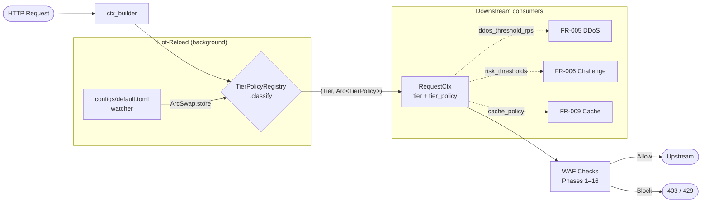

# Request Pipeline

Detailed walkthrough of the per-request processing path: tier classification, the Phase-0 access gate, and the 16-phase WAF rule pipeline. Extracted from [system-architecture.md](./system-architecture.md) for focus.

## Pre-Phase: Tier Classification (FR-002)

```
Tier Classification:
├─ RequestCtx populated in gateway::ctx_builder
├─ TierPolicyRegistry::classify(&request_parts) runs
├─ Returns (Tier, Arc<TierPolicy>) from current snapshot
├─ ctx.tier and ctx.tier_policy set before Phase 1
└─ All downstream phases read tier for policy-aware decisions
   (e.g., rate-limit threshold, block action per tier)
```

**Default**: If no tier registry configured at boot, uses `Tier::CatchAll` + permissive policy (fallback mode).

**Wired in**: `prx-waf/src/main.rs::try_init_tier_registry()` loads config, spawns `TierConfigWatcher` for hot-reload, injects registry into gateway.

### Tier Flow Diagram



See [tiered-protection.md](./tiered-protection.md) for the consumer guide.

---

## Pre-Phase: Relay & Proxy Detection (FR-007)

Detects relay/proxy traffic by validating HTTP headers (`XFF`, `X-Real-IP`) and classifying the true client IP. Runs **before** Phase-0 to populate `ClientIdentity` for downstream decisions.

```
Relay Detection:
├─ XffValidator: parse chain, detect spoofing (private IPs in trusted section)
├─ ProxyChainAnalyzer: count hop depth, emit ExcessiveHopDepth if >32
├─ AsnClassifier: lookup BGP ASN (mmdb: IPinfo Lite / iptoasn fallback)
├─ TorExitMatcher: check IP against Tor exit node set
├─ Emits signals: XffSpoofPrivate, XffMalformed, XffTooLong, TorExit, ...
└─ Output: ClientIdentity { real_ip, asn_class, asn, signals }
   └─ real_ip: IpAddr (either from XFF chain with trusted-proxy CIDR strip, or fallback to peer IP)
   └─ asn_class: AsnClass (Datacenter / Residential / Tor / Unknown)
   └─ signals: Vec<Signal> (for rule predicates and risk scoring)
```

**Configuration**: `rules/relay.yaml` (YAML schema). Specifies:
- `trusted_proxy_cidrs` — CIDR list for XFF chain trust boundary
- `asn_db_path` — mmdb file path (IPinfo Lite, MaxMind GeoLite2-ASN)
- `asn_fallback_feed_url` — HTTP endpoint for iptoasn TSV (if mmdb missing)
- `tor_feed_url` — HTTP refresh source for Tor exit node list (ETag-aware)
- `datacenter_overrides` — operator-defined ASN ranges to classify as datacenter

**Hot-reload**: File watcher on `rules/relay.yaml` → parsed config → `ArcSwap<RelayConfig>` (lock-free atomic swap). Intel feeds (Tor, ASN mmdb) refresh via background HTTP tasks with retry and ETag caching. Propagation ≤1s.

**Signals emitted** (consumed by rule predicates and risk-scorer):
- `XffSpoofPrivate` — RFC1918 IP in trusted section of XFF chain
- `XffMalformed` — unparseable XFF (non-IP, truncated, unicode)
- `XffTooLong` — chain >32 entries or header >8KB
- `ExcessiveHopDepth(n)` — n hops detected (after trusted-proxy strip)
- `TorExit` — IP matched Tor exit node list
- `AsnDatacenter` — IP classified as datacenter (EC2, GCP, Fastly, etc.)
- `AsnResidential` — IP classified as residential ISP

See **[planned signal-predicate docs (FR-025/026)]** for risk-scorer integration examples.

---

## Phase-0: Access Gate (FR-008)

Phase-0 gate runs **before** the pipeline: **(1)** IP whitelist (Patricia trie, per-tier `full_bypass` vs `blacklist_only` dispatch) → **(2)** IP blacklist (Patricia trie, longest-prefix v4/v6) → **(3)** URL whitelist (regex + literal) → **(4)** URL blacklist (regex + literal).

**Rationale**: Blacklist before whitelist prevents leaked whitelist IPs from bypassing explicit blocks.

**Configuration**: `rules/access-lists.yaml` (YAML v1). Hot-reload via `notify` (250ms debounce, SIGHUP forces immediate). Atomic `ArcSwap` swaps; on parse error, retains previous snapshot with `tracing::warn!`. Soft-warn ≥50k entries, hard-reject ≥500k.

**Audit Fields**: Every request stamped with `access_decision` (continue|bypass_all|host_gate|ip_blacklist), `access_reason`, `access_match` (host/IP or empty), `access_dry_run` (bool).

See [Access Lists Operator Guide](./access-lists.md) for full schema, worked examples, dry-run mode, troubleshooting.

---

## Phases 1-4: IP & URL Filtering (Fast-Path Access Control)

```
Phase 1: IP Whitelist (CIDR)
├─ Check if client IP in whitelist CIDR table
├─ If match → allow this phase, continue to Phase 2
└─ If no match → continue (whitelist is permissive)

Phase 2: IP Blacklist (CIDR)
├─ Check if client IP in blacklist CIDR table
├─ If match → BLOCK with 403 Forbidden (decision made)
└─ If no match → continue to Phase 3

Phase 3: URL Whitelist (regex + literal)
├─ Check if request path in allow_urls table
├─ If match → ALLOW (bypass all downstream phases)
└─ If no match → continue to Phase 4

Phase 4: URL Blocklist (regex + literal)
├─ Check if request path in block_urls table
├─ If match → BLOCK with 403 Forbidden
└─ If no match → continue to Phase 19
```

**Note**: URL whitelists take precedence over the entire rule pipeline — matching URLs skip all downstream checks.

## Phase 19: DDoS Detection (FR-005)

```
FR-005 DDoS Protection: Multi-layer detection with dynamic banning
├─ Position: AFTER fast-path (Phase 1-4), BEFORE rate-limit
├─ Short-circuit: banned IPs checked first → 403 DDOS-BAN (pre-computed)
├─ Three detectors run in parallel:
│  ├─ PerIpDetector: sliding-window counter per IP
│  │  └─ threshold: tier.policy.ddos_threshold_rps (requests/sec)
│  │  └─ window: 1 second
│  ├─ PerFingerPrintDetector: sliding-window per device fingerprint (if available)
│  │  └─ groups requests by FpKey across multiple IPs (botnet detection)
│  │  └─ fallback to PerIpDetector if FpKey unavailable
│  └─ PerTierDetector: adaptive threshold per tier (Critical/High/Medium/CatchAll)
│     └─ detects tier-wide bursts; config: ddos.per_tier.<tier>_threshold_rps
├─ On detector trigger (HardBurst event):
│  ├─ DdosAction::Ban → add IP to ban table (TTL: 60s default)
│  │  └─ subsequent requests from banned IP short-circuit → 403 DDOS-BAN
│  ├─ DdosAction::RiskBump → emit Signal::DdosSuspected (to FR-025 risk scorer)
│  └─ DdosAction::Degrade → on store error (Redis down):
│     ├─ tier.policy.fail_mode == Close → BLOCK (safe-default)
│     └─ tier.policy.fail_mode == Open → ALLOW (assume legitimate)
├─ Store backend: MemoryStore (100K cap, idle eviction) or RedisStore (Lua script)
├─ BreakerStore circuit-breaker: fallback to memory on >5 Redis failures
├─ Metrics: ddos_detector_evaluations_total, ddos_hard_burst_total, ddos_bans_issued_total
│  └─ Labels: {tier, detector_type, error_kind}
└─ If no burst detected → continue to Phase 5

Config: configs/default.toml [ddos] section
Operator guide: docs/ddos-protection.md
```

## Phases 5-11: Rate Limiting & Attack Detection Pipeline

### Phase 5: Rate Limiting (FR-004)

```
FR-004 Rate Limiting: Tiered token-bucket + sliding-window
├─ Key 1: ip:<host>:<client_ip> (checked first, IP-based limit)
│  ├─ Algorithm: token-bucket (burst) + sliding-window (sustained)
│  ├─ Config: per-tier burst_capacity, burst_refill_per_s, window_secs, window_limit
│  ├─ Store: MemoryStore (100K cap, 10min idle eviction) or RedisStore (Lua roundtrip)
│  └─ BreakerStore wraps both: circuit-breaker (default 5 failures) → fallback to memory
├─ If IP key fails → BLOCK with rule ID RL-IP (fail-mode: tier.Close=block, Open=pass)
├─ Else check Key 2: sess:<host>:<session_id> (session/device-fp, fallback if cookie present)
│  └─ If session key fails → BLOCK with rule ID RL-SESSION
├─ If both Allow → continue to Phase 6
└─ Rule ID RL-ERR on check error (fail-mode honored per tier policy)

Config: configs/rate-limit.yaml (hot-reload via notify, 200ms debounce, ArcSwap)
```


### Phase 5.5: Transaction Velocity & Sequence (FR-012)

```
FR-012 Transaction Velocity: Cross-endpoint behavioral fraud detection
├─ Position: AFTER rate-limit (shed flood traffic first), BEFORE scanner
├─ RoleTagger: regex match request path → EndpointRole
│  └─ {Login, Otp, Deposit, Withdrawal, LimitChange, None}
│  └─ None → skip tracking, continue to Phase 6
├─ SessionKey extract: cookie value (configurable name) ?? FpKey (FR-010 fallback)
│  └─ neither present → skip tracking, continue to Phase 6
├─ TxStore.record(key, Event {role, ts_ms, ok}):
│  └─ DashMap<SessionKey, ActorTx>; ArrayVec<Event, 16> ring buffer
│  └─ Drops oldest event on overflow
├─ Cooldown gate: if now_ms - last_signal_ms < signal_cooldown_ms → skip
├─ Run 3 classifiers (each <20µs):
│  ├─ SequenceTimingClassifier: Login→OTP→Deposit faster than min_human_ms
│  │  → Signal::TxSequenceTooFast { from, to, interval_ms }
│  ├─ WithdrawalVelocityClassifier: ≥N withdrawals / window_ms
│  │  → Signal::WithdrawalVelocity { count, window_sec }
│  └─ LimitChangeBurstClassifier: ≥M limit-changes / window_ms
│     → Signal::LimitChangeBurst { count, window_sec }
├─ Submit signals to RiskAggregator (fire-and-forget via tokio::spawn)
├─ Janitor (tokio interval): purges idle sessions (TTL session_ttl_secs)
└─ Returns None — SIGNAL-ONLY, never blocks. Continue to Phase 6.

Config: configs/tx-velocity.yaml (hot-reload via notify, ArcSwap, schema v1)
Operator guide: docs/transaction-velocity.md
```

### Phases 6-11: Attack Detection Checkers (Ordered)

Runs in pipeline order; first match blocks the request.

```
Phase 6: Scanner Detection
├─ Fingerprint User-Agent against scanner signatures (Nmap, Nikto, etc.)
├─ Pattern matching on request anomalies
├─ Emits scanner signals for risk scoring
└─ If signature match → BLOCK or log (configurable)

Phase 7: Bot Detection
├─ User-Agent against known bot list (headless browsers, etc.)
├─ Browser fingerprinting anomalies (FR-010 integration)
├─ If malicious bot pattern → BLOCK
└─ else → continue to Phase 8

Phase 8: XSS Detection
├─ libinjectionrs detect_xss fingerprint engine
├─ Regex patterns for script tags, event handlers
├─ If XSS injection payload detected → BLOCK
└─ else → continue to Phase 9

Phase 9: RCE Detection
├─ Shell metacharacter injection patterns
├─ Expression language injection (${}, #{}, etc.)
├─ Template injection (Jinja2, Freemarker, etc.)
├─ If RCE pattern detected → BLOCK
└─ else → continue to Phase 10

Phase 10: Directory Traversal
├─ Normalize path (decode, resolve ../)
├─ Check for escapes, Windows alternate data streams (::$DATA)
├─ If traversal detected → BLOCK
└─ else → continue to Phase 11

Phase 11: SSRF Detection (FR-016)
├─ Extract all http(s):// URLs from body/query/cookies/headers
├─ Detect cloud-metadata IPs, RFC1918, loopback, link-local
├─ Obfuscation handling: dword/hex/octal/IPv6-mapped forms
├─ Outbound allowlist bypass check
├─ v1 limitation: no DNS resolution (DNS-rebinding mitigation deferred)
└─ If private IP destination detected → BLOCK

Phase 12: Header Injection Detection (FR-017)
├─ CRLF injection detection in header name/value (response splitting)
├─ Host header validation against per-host inbound whitelist
├─ X-Forwarded-For sanity check (leftmost-private, excessive hop-count)
├─ v1 limitation: no SNI-vs-Host comparison (Red Team Finding #12)
└─ If injection pattern detected → BLOCK

Phase 13: Brute Force Protection (FR-018)
├─ Per-user login route failure tracking (user_hash, ip)
├─ Request phase: block if failure count >= bf_max_per_user
├─ Spray detection: block if password sprayed to >= bf_spray_threshold users from one IP
├─ Response phase: on_response() records 401/403 as login failures (status-code-only)
├─ v1 limitation: no body regex failure detection (security concerns)
└─ If threshold breach → BLOCK with BF-001 or BF-002

Phase 14: Request Body Abuse Detection (FR-020)
├─ Oversized body check (declared Content-Length > max_body_size)
├─ Content-Type magic-byte sniff validation
├─ JSON depth pre-check (bails before parse if exceeds max_json_depth)
├─ JSON parse validation (failure → block)
├─ JSON key explosion check (cumulative key count vs max_json_keys)
└─ If abuse detected → BLOCK
```

## SQL Injection Detection (Separate from Pipeline)

```
SQL Injection Check (Hot-reloadable):
├─ Position: After Phase 14, before Phase 16b CrowdSec AppSec
├─ Scope: request body + query string (up to 256KB JSON)
├─ Fingerprint: libinjectionrs detect_sqli engine
├─ Patterns: 19 modular regex rules (SQLI-001..019: classic, blind, error-based)
├─ Config: SqliScanConfig (header/JSON toggles, denylist/allowlist, 4KB header cap)
├─ Hot-reload: separate from main checker pipeline for fine-grained control
└─ If SQL injection payload detected → BLOCK
```

**Note**: SQLi check runs after the main Phase 5-14 pipeline but before CrowdSec AppSec and custom rules. This separation allows independent hot-reload tuning.

## Phase 16a: CrowdSec Bouncer (Fast Cache Lookup, Early-Path)

```
CrowdSec Bouncer (Phase 16a):
├─ Position: EARLY-PATH, runs after Phase 4 URL filters, before Phase 19 DDoS
├─ Query CrowdSec bouncer for active decisions on client IP
├─ Local cache hit → apply decision immediately (no network latency)
├─ If IP has active decision (ban, captcha, etc.) → apply action
├─ Fallback: no cache entry → proceed to Phase 19 DDoS
└─ If blocked → 403 Forbidden with CrowdSec decision

Note: This is an "early phase" — runs in the fast-path before DDoS detection
to reject known-bad IPs before rate-limit and detection overhead.
```

## Phase 17: GeoIP Access Control (Early-Path)

```
GeoIP Check (Phase 17):
├─ Position: EARLY-PATH, runs after Phase 16a CrowdSec, before Phase 19 DDoS
├─ Enrichment: GeoIP lookup populates ctx.geo early (after Phase-0)
├─ Per-tier geo rules: allow/deny countries based on tier policy
├─ IP2region + MaxMind lookups with background DB updater
├─ Cache: fast O(1) geo lookup before rate-limit overhead
└─ If geo rule blocks → 403 Forbidden

Note: Early geo block avoids wasting rate-limit tokens on blocked countries.
```

## Phase 18: Community Blocklist (Early-Path)

```
Community Blocklist (Phase 18):
├─ Position: EARLY-PATH, runs after Phase 17 GeoIP, before Phase 19 DDoS
├─ O(1) DashMap IP lookup against community-enrolled blocklist
├─ Rule ID emission: community:<source> (e.g., community:abuseipdb)
├─ CommunityReporter: batch signals + async push to community API
├─ Confidence mapping per detection phase (adjust score by phase)
└─ If IP in blocklist → 403 Forbidden

Note: Community blocklist provides cross-organization threat intel.
```

## Post-Detection Pipeline: Custom Rules & Integrations

Final checks after the main attack detection pipeline:

```
Phase 16b: CrowdSec AppSec (Async HTTP Check)
├─ Position: After SQL injection check, before Custom Rules
├─ Async per-request HTTP check to CrowdSec AppSec API
├─ Fallback: unavailable → log and continue
└─ If blocked by AppSec → 403 Forbidden

Custom Rules Engine (FR-003, User-Defined Logic)
├─ Load from custom_rules table (Rhai scripts + JSON DSL)
├─ Execute Rhai scripts in sandboxed environment
├─ Evaluate JSON DSL conditions
├─ If rule matches → action (block/log/challenge)
└─ else → continue to OWASP CRS

OWASP CRS (Core Rule Set, Pre-compiled Patterns)
├─ 24 pre-compiled rule patterns
├─ Categories: XSS, SQLi, RCE, RFI, LFI, protocol violations, etc.
├─ If CRS rule matches → action (block/log)
└─ else → continue to Sensitive Data

Sensitive Data Leakage Detection
├─ Aho-Corasick multi-pattern matching
├─ Patterns: credit card numbers, SSN, API keys, passwords, etc.
├─ If sensitive data in request → log & continue (or block)
└─ else → continue to Anti-Hotlink

Anti-Hotlink Protection
├─ Check Referer header
├─ If Referer not in allowed list → BLOCK (return 403)
└─ else → ALLOW (all phases passed)
```

**FINAL DECISION**: Allow / Block / Challenge

## Post-Decision (Final Response Handling)

```
After all checks complete:
├─ Decision = Allow
│  ├─ Route to backend (vhost → load balancer → upstream)
│  ├─ Receive response from backend
│  ├─ FR-009 Smart Cache: Check tier gate (CRITICAL never cached)
│  │  → MethodGate, AuthGate, RouteRuleGate, UpstreamCcGate, TierDefaultGate
│  │  → If cacheable: store in moka LRU (tag index updated for purge)
│  └─ Return response to client
│
├─ Decision = Block
│  ├─ Return HTTP 403 Forbidden with rendered block page
│  ├─ Log to security_events table
│  ├─ Report to community blocklist (if enrolled)
│  ├─ Send audit event to configured sink
│  └─ Increment security metrics (blocked_requests_total)
│
└─ Decision = Challenge (FR-004 rate limit)
   ├─ Return HTTP 429 Too Many Requests (or CAPTCHA page)
   ├─ Log to security_events
   └─ Wait for client to solve challenge before allowing
```

---

## Related Docs

- [system-architecture.md](./system-architecture.md) — Topology, components, storage, cluster.
- [tiered-protection.md](./tiered-protection.md) — Tier classifier consumer guide.
- [access-lists.md](./access-lists.md) — Phase-0 access gate operator guide.
- [ddos-protection.md](./ddos-protection.md) — Phase 19 DDoS burst detection and banning.
- [transaction-velocity.md](./transaction-velocity.md) — Phase 5.5 (FR-012) cross-endpoint fraud detection.
- [custom-rules-syntax.md](./custom-rules-syntax.md) — Phase 15 custom rule schema (Rhai + JSON DSL).
- [device-fingerprinting.md](./device-fingerprinting.md) — FR-010 device identity (SessionKey fallback for Phase 5.5).
- **FR-016 SSRF Detection** — Phase 11 server-side request forgery detection with private IP obfuscation handling.
- **FR-017 Header Injection** — Phase 12 CRLF injection + Host header validation.
- **FR-018 Brute Force** — Phase 13 per-user failure tracking with spray detection.
- **FR-020 Body Abuse** — Phase 14 oversized/malformed request body detection.
