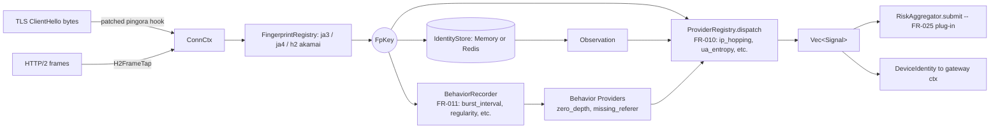

# System Architecture

## High-Level Topology

```
┌─────────────────────────────────────────────────────────────┐
│                    Clients (Internet)                        │
└────────────────────────┬────────────────────────────────────┘
                         │
        ┌────────────────┼────────────────┐
        ▼                ▼                ▼
    HTTP/1.1         HTTP/2            HTTP/3 (QUIC)
    (port 80)      (port 443)         (port 443)
        │                │                │
        └────────────────┴────────────────┘
                         │
        ┌────────────────▼────────────────┐
        │      Pingora Reverse Proxy      │
        │   (gateway crate)               │
        │  - TLS termination (OpenSSL)    │
        │  - Load balancing (round-robin) │
        │  - Response caching (moka LRU)  │
        │  - Health checks                │
        │  - RequestFilter chain (phase01)│
        │  - ResponseFilter chain (phase01)
        └────────────────┬────────────────┘
                         │
        ┌────────────────▼────────────────┐
        │    WafEngine (16-phase checks)  │
        │   (waf-engine crate)            │
        │  - IP allow/block               │
        │  - URL patterns                 │
        │  - Rate limiting (CC/DDoS)      │
        │  - Scanner + Bot detection      │
        │  - SQLi/XSS/RCE/Traversal       │
        │  - Custom rules (Rhai/JSON)     │
        │  - OWASP CRS (24 rules)         │
        │  - Sensitive data detection     │
        │  - Anti-hotlink                 │
        │  - CrowdSec integration         │
        │  - Device fingerprinting        │
        │    (FR-010: TLS ClientHello +   │
        │     H2 frame capture)           │
        └────────────────┬────────────────┘
                         │
        ┌────────────────▼────────────────┐
        │   Decision: Allow / Block       │
        │   (WafAction::Allow/Block)      │
        └────────────┬───────────────────┘
                     │
     ┌───────────────┴───────────────┐
     ▼                               ▼
  ALLOW                            BLOCK
     │                               │
     ▼                               ▼
Backend                        Return 403 Forbidden
(upstream                       (or 429 for rate limit)
server)                         Log: security_events +
                                attack_logs
```

---

## Request Lifecycle

Per-request flow runs in five stages:

1. **Pre-Phase — Relay Detection (FR-007)** — `RelayDetector::evaluate` validates XFF / X-Real-IP headers, detects trusted-proxy chains, classifies ASN (residential/datacenter/Tor), and emits signals. Output `ClientIdentity { real_ip, asn_class, asn, signals }` attached to `RequestCtx` for downstream rule predicates.
2. **Pre-Phase — Tier Classification (FR-002)** — `TierPolicyRegistry::classify` resolves `(Tier, Arc<TierPolicy>)` from request parts; result attached to `RequestCtx` before any phase.
3. **Phase-0 — Access Gate (FR-008)** — Host gate → IP blacklist → IP whitelist (per-tier `full_bypass`/`blacklist_only` dispatch). *Future*: IP evaluation to use `ClientIdentity.real_ip` instead of peer IP. Short-circuits before the rule pipeline.
4. **Phases 1–16 — Rule Pipeline** — IP/URL filtering → **FR-004 rate limiting (IP + session keys, token-bucket + sliding-window per tier)** → **FR-005 DDoS detection (per-IP/per-fingerprint/per-tier sliding-window with dynamic banning and graceful degrade)** → **FR-011 behavioral anomaly detection (per-actor cadence/path classifiers, 16-slot ring, signal cap ≤40)** → **FR-012 transaction velocity (session role-tagging, sequence timing, withdrawal bursts)** → payload attacks (SQLi/XSS/RCE/traversal) → custom rules → OWASP CRS → sensitive data → anti-hotlink → CrowdSec. Final decision: Allow / Block / Challenge.
5. **Risk Scoring (FR-025)** — **L0 Seed (Tor/ASN/whitelist baseline) + L1 Accumulation (per-actor state machine, IP/fingerprint/session triple-index with merge-on-collide) + L2 Anomaly (JA4↔UA mismatch, XFF chain, header sanity) + L2 Velocity (sliding window, sequence FSM)**. Risk deltas accumulated from all upstream checks and signals. Decay mechanism reduces stale risk. Thresholds gate: Allow (<X) / Challenge (X–Y) / Block (>Y). Hot-reload config via ArcSwap. Emits `X-WAF-Risk-Score` header. Integrates with tier-specific risk policies.
6. **Post-Decision — FR-009 Smart Caching** — If Allow: tier gate (CRITICAL never cached) → Chain-of-Responsibility gates → store response in moka LRU if eligible (tags indexed for purge).

Full per-phase walkthrough, mermaid diagrams, and post-decision handling: see **[request-pipeline.md](./request-pipeline.md)**.

---

## Component Interaction

### Gateway (Pingora) → WafEngine

```rust
// In gateway::proxy.rs
impl ProxyHttp for WafProxy {
    async fn request_filter(&mut self, session: &mut Session) -> Result<()> {
        let req = &session.req_header;
        
        // Build RequestCtx with tier classification (FR-002)
        let mut builder = RequestCtxBuilder::new(session, ...);
        if let Some(registry) = &self.tier_registry {
            builder = builder.with_tier_registry(registry);
        }
        let ctx = builder.build()?;
        // ctx.tier and ctx.tier_policy now populated from TierPolicyRegistry
        
        // Ask WafEngine to check all 16 phases
        let decision = self.engine.check(&ctx).await?;
        
        match decision.action {
            WafAction::Allow => {
                // Continue to backend
                Ok(())
            },
            WafAction::Block => {
                // Return 403 (or 429 based on tier policy)
                session.send_response(403, "Forbidden")?;
                Ok(())
            },
            // ... other actions
        }
    }
}
```

### Gateway → RelayDetector (FR-007)

```rust
// In gateway::proxy.rs, early in request_filter()
let detector = &self.relay_detector;  // RelayDetector instance
let client_identity = detector.evaluate(
    peer_ip,                            // TCP remote address
    &req.headers,                       // HTTP headers (XFF, X-Real-IP, etc.)
    &self.relay_config,                 // RelayConfig (trusted-proxy CIDRs, ASN db)
)?;

// Output: ClientIdentity {
//   real_ip: IpAddr,               // Derived from XFF or fallback to peer_ip
//   asn_class: AsnClass,           // Datacenter / Residential / Tor
//   asn: Option<u32>,              // BGP ASN if found
//   signals: Vec<Signal>,          // XffSpoofPrivate, XffMalformed, ExcessiveHopDepth, TorExit, etc.
// }

// Attach to RequestCtx for rule predicates (FR-025/026)
let mut builder = RequestCtxBuilder::new(session, ...);
builder = builder.with_client_identity(client_identity);
// ... rest of ctx building
```

**Multi-provider architecture:**
- `XffValidator` — parses XFF chain, detects spoofing (private IPs in trusted section)
- `ProxyChainAnalyzer` — counts hop depth, emits `ExcessiveHopDepth` signal if >32
- `AsnClassifier` — mmdb lookup (IPinfo Lite primary, fallback iptoasn TSV)
- `TorExitMatcher` — checks IP against Tor exit node set (refreshed hourly via HTTP+ETag)

**Hot-reload:** File watcher on `rules/relay.yaml` monitors config changes (trusted-proxy CIDRs, ASN db path, Tor feed URL, refresh intervals). Changes propagate via `ArcSwap` (lock-free atomic swap) with ≤1s latency.

### Gateway → DeviceFpDetector (FR-010)

Operator guide: [`device-fingerprinting.md`](device-fingerprinting.md).



```rust
// In gateway::proxy.rs, immediately after RelayDetector
let detector = &self.device_fp_detector;  // Arc<DeviceFpDetector>
let device_identity = detector
    .process(peer_ip, user_agent, &conn_ctx)  // ConnCtx holds raw L4 capture
    .await;

// Output: DeviceIdentity {
//   key: Arc<FpKey>,            // Composite ja3 / ja4 / h2_akamai hashes
//   signals: Vec<Signal>,       // FpConflict, IpHopping, LowEntropyUa, UaBlocklisted, H2Anomaly
// }
```

**Pipeline (`DeviceFpDetector::process`):**
1. `FingerprintRegistry::assemble` → `FpKey` from `RawCapture`.
2. `IdentityStore::observe` (when configured + key non-empty) → `Observation` (sliding-window distinct IPs/UAs).
3. `ProviderRegistry::dispatch` → `Vec<Signal>`.
4. `RiskAggregator::submit` (fire-and-forget) → FR-025 plug-in.

#### FR-025 plug-in contract

`device_fp/` ships `RiskAggregator` (in `crates/waf-engine/src/device_fp/aggregator.rs`) and a `NoopAggregator` default. FR-025 lives in its own crate, implements the trait, and is wired in by the binary:

```rust
use waf_engine::device_fp::{DeviceFpDetector, RiskAggregator, FpKey, Signal};

pub struct ScoringAggregator {
    tx: tokio::sync::mpsc::Sender<Job>,
}

#[async_trait::async_trait]
impl RiskAggregator for ScoringAggregator {
    async fn submit(&self, key: &FpKey, signals: &[Signal]) {
        let job = Job { key: key.clone(), signals: signals.to_vec() };
        if self.tx.try_send(job).is_err() {
            tracing::warn!("risk-scorer queue full, dropping submission");
        }
    }
}

// Wiring:
let detector = DeviceFpDetector::new(cfg, registry)
    .with_store(Arc::new(MemoryIdentityStore::default()))
    .with_aggregator(Arc::new(ScoringAggregator::new()));
```

**Contract rules:**
- `submit` is async but MUST NOT block the caller — fan out to a bounded channel internally and drop-with-warn on overflow.
- Caller treats `submit` as fire-and-forget; no result, no error path.
- `key` is borrowed; clone if the impl retains it past the call.
- `device_fp/` never depends on the FR-025 crate — wiring lives at the binary entry point only.

`LoggingAggregator` (same module) is a test/dev impl that records submissions into a bounded ring buffer for assertions.

### WafEngine → Risk Scorer (FR-025)

**Cumulative risk scoring subsystem** — Tracks per-actor risk state and applies threshold gates to emit Allow / Challenge / Block decisions. Integrates signals from all upstream checks (rule matches, anomalies, DDoS) and decays stale risk. Pluggable backend (memory or Redis).

**L0 seed layer evaluation:** IP reputation baseline (Tor exits, ASN classification, whitelist) evaluated before other risk layers via file-based data sources (`configs/seed/`). Whitelist entries bypass all scoring (immediate Allow).

```
Seed Layer (Tor/ASN/Whitelist) ─────┐
                                    │
Upstream Signals (rules, ddos, etc.)├──► Scorer::score(ctx, fp_key, deltas, now_ms)
    │
    ├─ Build RiskKey (IP, fingerprint, session triple-index)
    │
    ├─ RiskStore::apply(key, deltas, now_ms)
    │   │ (Memory or Redis backend)
    │   ├─ Memory: in-process HashMap with optional decay call
    │   │
    │   └─ Redis: Lua script atomically (single RTT)
    │       ├─ Fetch or create RiskState + owner_id
    │       ├─ Apply decay (raw_score decays by 0-50 points)
    │       ├─ Fold in new contributors (signal deltas)
    │       ├─ Clamp score to [0, 100]
    │       └─ EXPIRE key (per ttl_secs config)
    │
    ├─ Threshold gate: decide(score, tier_policy.risk_thresholds)
    │   ├─ score < allow_threshold    → Allow
    │   ├─ score < challenge_threshold → Challenge (CAPTCHA, JS POW)
    │   └─ score >= challenge_threshold → Block
    │
    └─ Emit X-WAF-Risk-Score header + return WafAction
```

**RiskKey triple-index (collision & merge strategy):**
- IP-based: `waf:risk:idx:ip:{client_ip}` (Redis) or memory key
- Fingerprint-based: `waf:risk:idx:fp:{fp_hash}` (Redis) or memory key
- Session-based: `waf:risk:idx:sid:{session_id}` (Redis) or memory key

When multiple keys match a single request, all three states merge via `force_max_script` (Redis) or in-memory merge (highest score wins, contributors union).

**Backend Configuration (Phase 7)**

| Aspect | Memory | Redis |
|--------|--------|-------|
| **Deployment** | Single-node / dev | Cluster / high-volume |
| **Storage** | In-process HashMap | Distributed key-value |
| **Persistence** | Lost on restart | Persisted (RDB/AOF) |
| **Consistency** | Per-request local | Atomic Lua scripts |
| **Failover** | N/A | Circuit breaker + LRU fallback |
| **Config** | `store.backend = "memory"` | `store.backend = "redis"` + redis.* |

**Redis Lua Scripts (Atomic Operations)**
1. `apply_script` — Decay + fold deltas + EXPIRE in single RTT
2. `mint_or_get_owner_script` — Idempotent owner_id creation (UUID v4)
3. `force_max_script` — Merge colliding keys by score (used during incident response)

**Circuit Breaker & Fail-Open (Redis Only)**
- Opens after `breaker_threshold` (default: 5) consecutive failures
- Falls back to in-memory LRU cache (`cache_capacity`, default: 10k)
- Requests proceed with local cache; Redis resync on next success
- No request blocking during Redis outage

**L2 Anomaly Layer (Phase 5):** Inline synchronous detectors evaluated per-request: (1) JA4↔UA mismatch (TLS fingerprint vs User-Agent family incompatibility, +20), (2) XFF chain sanity (malformed or excessive hop counts, +10 cap), (3) Header sanity (missing required headers or impossible combinations, +15 cap).

**L2 Velocity Layer (Phase 5):** Request-rate and transaction-sequence detectors: (1) Sliding window (60×1s ring buffer; request-rate threshold breach → +25), (2) Sequence FSM (Login→OTP→Withdrawal path validation; out-of-order or timing anomalies → +30).

**Risk contributions:**
- Rule matches (e.g., SQLi detected) — delta from `rule.risk_score_delta` in YAML (0–50 points)
- Signal providers (FR-010, FR-011, FR-012 anomalies) — delta from signal enum (5–20 points)
- DDoS detector verdicts (FR-005) — delta bump for detected floods (5–30 points)
- L2 Anomaly detectors (JA4↔UA, XFF, headers) — delta 10–20 points
- L2 Velocity detectors (sliding window, sequence FSM) — delta 25–30 points

**Decay mechanism:**
- Linear decay: `raw_score -= decay_factor * time_ms` (configurable, default 1 pt/min)
- Floor: score never drops below 0 or above 100
- Clean streak: increments when no new signals in a window (soft reset threshold)

**Configuration (hot-reload via `configs/risk.yaml`):**
```yaml
[risk]
enabled = true
decay_enabled = true
decay_factor_per_min = 1.0        # Points lost per minute of inactivity
allow_threshold = 30              # Risk score below this → Always Allow
challenge_threshold = 60          # Risk score [allow, challenge) → Challenge
use_ip_key = true
use_fingerprint_key = true
use_session_key = true            # Requires session cookie / FR-010 FpKey
max_state_age_secs = 3600         # Purge risk states older than this
```

**Integration points:**
- **During rule evaluation** (Phase N) — Accumulate risk deltas in `RequestCtx.risk_deltas`
- **Post-rule pipeline** — `Scorer::score()` applies accumulated deltas + applies decay + thresholds
- **Header emission** — `X-WAF-Risk-Score: <0-100>` sent in all responses
- **Tier policy** — `tier_policy.risk_thresholds` (allow/challenge/block points) per tier

**Module:** `crates/waf-engine/src/risk/` (scorer.rs, key.rs, state.rs, score.rs, decay.rs, threshold.rs, config.rs, reload.rs, store/, seed/, anomaly/, velocity/, ingest/, tests/).

### WafEngine → PostgreSQL Storage

```rust
// In waf-engine::engine.rs
pub struct WafEngine {
    pub store: Arc<RuleStore>,           // In-memory registry
    pub db: Arc<Database>,               // PostgreSQL connection pool
    pub custom_rules: Arc<CustomRulesEngine>,
}

// On startup: load rules from disk + database
async fn init(db: Arc<Database>) -> Result<Self> {
    // Load built-in YAML rules from disk
    let yaml_rules = load_yaml_rules("rules/")?;
    
    // Load custom rules from PostgreSQL
    let custom_rules = db.list_custom_rules().await?;
    
    // Build RuleRegistry (in-memory)
    let registry = RuleRegistry::new();
    for rule in yaml_rules.chain(custom_rules) {
        registry.insert(rule);
    }
    
    Ok(Self {
        store: Arc::new(RuleStore { registry }),
        db,
        custom_rules: Arc::new(CustomRulesEngine::new()),
    })
}

// During request: write to database
async fn log_attack(&self, event: SecurityEvent) -> Result<()> {
    self.db.create_security_event(event).await?;
    Ok(())
}
```

### WafAPI → Database → Admin UI

```
Admin UI (Vue 3)
    │
    ├─ POST /api/hosts  ────────────►  Axum Router
    │                                      │
    │                                      ▼
    │                             JWT Auth Middleware
    │                                      │
    │                                      ▼
    │                             Handler: create_host()
    │                                      │
    │                                      ▼
    │                             Database: db.create_host()
    │                                      │
    │                                      ▼
    │                             PostgreSQL: INSERT INTO hosts
    │                                      │
    │  ◄──── JSON Response ────────────────┘
```

---

## Data Flow (In-Memory vs Storage)

### Configuration (Startup → Runtime)

```
config.toml (disk)
    │
    ▼
AppConfig struct (parsed by toml crate)
    │
    ▼
Arc<AppConfig> (shared, immutable)
    │
    ├─► Pingora (proxy config)
    ├─► WafEngine (rule config, check params)
    ├─► WafAPI (API config, CORS, auth)
    └─► WafCluster (cluster config, election params)
```

**Note**: No runtime config changes. Changes require restart.

### Rules (Disk + Database → In-Memory)

```
Disk (rules/*.yaml)  ──┐
                       │
Database (custom_rules) ──► RuleRegistry (Arc<RwLock>)
                       │        │
                       │        ├─► On every request: check()
                       │        │
                       │        └─► Hot-reload: reload_rules()
                       │
File watcher (notify) ─┘
```

**Cache**: Rules versioned (u64). Workers sync incremental diffs.

### Admin Control Plane: Panel Config API

**Panel-Config** (`waf-panel.toml`) holds operational settings via `GET/PUT /api/panel-config`. Config struct: `ResponseFilteringPanel`, `TrustedBypassPanel`, `RateLimitsPanel`, `AutoBlockPanel`. Validations: risk thresholds (allow < challenge < block), CIDR/IP syntax (v4/v6), honeypot paths. Atomic write-through to file. Frontend: Admin UI settings page (`web/admin-panel/src/pages/settings/index.tsx`) with i18n.

### Custom File-Based Rules (FR-003)

File watcher on `rules/custom/*.yaml` auto-loads YAML docs marked `kind: custom_rule_v1`. Per-file error isolation (bad files skip, previous version retained). 500ms debounce. Schema via `custom_rule_yaml.rs` enforces version discriminator; forward-compat rejects unknown `custom_rule_v*`. Atomically loaded via RuleRegistry; no in-flight disruption.

**Extended Rule Schema (FR-025):** Rules support optional risk scoring fields:
- `risk_delta: i16` — Score contribution when rule matches (positive increases risk, negative decreases)
- `risk_action: String` — Override action ("block" forces immediate block regardless of score)

Per-request delta clamping: positive deltas summed, capped at 100, oldest truncated if exceeded. `X-WAF-Rule-Id` header set to dominant contributor (rule with max |delta|). See `docs/code-standards.md` for delta convention table.

### Logs (Per-Request → Batch → Database)

```
WafEngine.check() → decision

If Block:
    event = SecurityEvent {
        timestamp,
        client_ip,
        rule_id,
        action,
        path,
        ...
    }
    
    db.create_security_event(event).await?
        │
        ▼
    PostgreSQL: security_events table
        │
        ▼
    (Async) db.broadcast(event)  ──► WebSocket subscribers (/ws/events)
```

### Statistics (In-Memory Counter → Database)

```
RequestStats (parking_lot::Mutex) ──┐
    total_requests: u64              │
    blocked_requests: u64            │
    top_rules: DashMap               │
    top_ips: DashMap                 │
    top_countries: DashMap           │
                                     │
                        ┌────────────┘
                        │
                        ▼ (every 30s via tokio::time::interval)
                        
                    db.update_stats()
                        │
                        ▼
                    PostgreSQL: request_stats table
```

---

## Cluster Architecture

### Single-Node (Standalone)

```
┌─────────────────────────┐
│   PRX-WAF Process       │
├─────────────────────────┤
│ Pingora (proxy)         │
│ WafEngine (checks)      │
│ WafAPI (admin UI)       │
│ PostgreSQL Client       │
└─────────────────────────┘
         │
         ▼
   PostgreSQL 16+
```

### 3-Node Cluster (High Availability)

```
                  QUIC mTLS Mesh (port 16851)
                    ┌──────────────────┐
                    │                  │
        ┌───────────▼──────────┐       │
        │    Node A (Main)     │       │
        ├──────────────────────┤       │
        │ Pingora proxy        │───────┼─────────┐
        │ WafEngine            │       │         │
        │ WafAPI (read-write)  │       │         │
        │ PostgreSQL client    │       │         │
        │ Role: control plane  │       │         │
        └──────────┬───────────┘       │         │
                   │                   │         │
                   ▼                   │         │
            PostgreSQL 16+             │         │
           (primary)                   │         │
                   ▲                   │         │
                   │                   │         │
           ┌───────┴───────┐           │         │
           │               │           │         │
   ┌───────▼──────────┐ ┌──▼──────────▼──────┐  │
   │  Node B (Worker) │ │  Node C (Worker)   │  │
   ├──────────────────┤ ├────────────────────┤  │
   │ Pingora proxy    │ │ Pingora proxy      │  │
   │ WafEngine        │ │ WafEngine          │  │
   │ WafAPI (fwd)     │ │ WafAPI (fwd)       │  │
   │ RuleRegistry     │ │ RuleRegistry       │  │
   │ Role: data plane │ │ Role: data plane   │  │
   │ (no DB)          │ │ (no DB)            │  │
   └────────┬─────────┘ └──────────┬─────────┘  │
            │                      │            │
            │ Write requests       │            │
            │ forwarded to main    │            │
            └──────────┬───────────┘            │
                       │                        │
                       ▼                        │
         ┌─ Main's API handler ◄───────────────┘
         │ (via QUIC ApiForward stream)
         │
         ▼
    Persists to PostgreSQL
    Broadcasts to other nodes
```

**Data Flow in Cluster:**

1. **Worker receives request** → checks rules (in-memory RuleRegistry)
2. **Admin edits rule on main** → main writes to PostgreSQL
3. **Rule sync triggers** → main sends RuleSyncResponse to all workers
4. **Worker receives rule update** → updates in-memory RuleRegistry (version++)
5. **Worker processes request** → uses updated rule (no downtime)

### Leader Election (Raft-Lite)

```
Node A (Main)          Node B (Worker)        Node C (Worker)
    │                      │                       │
    │──────── heartbeat ───────────►               │
    │                      │                       │
    │                      ◄──── heartbeat ack ────┤
    │
    ├─ If no heartbeat from A within 150-300ms:
    │
    └─► Become Candidate
        ├─ Increment term (e.g., 5 → 6)
        ├─ Vote for self
        ├─ Send ElectionVote to all peers
        │
        B & C receive ElectionVote(term=6, candidate=B)
        ├─ Grant vote (if term > current term)
        ├─ Send ElectionResult back
        │
        B receives 2 votes (self + C)
        ├─ Majority reached (2/3)
        ├─ Become Main
        ├─ Broadcast ElectionResult(term=6, elected=B)
        │
        C receives ElectionResult
        └─ Demote to Worker, accept B as Main
```

**Election Timeline:**
- Detection: <150ms (if main dies suddenly)
- Voting round: <100ms
- New main operational: <500ms total

---

## Storage Layer (PostgreSQL)

### Schema Overview

**Configuration Tables**
- `hosts` — Virtual host config (upstream, ports, LB backends, SSL)
- `allow_ips`, `block_ips` — IP CIDR lists
- `allow_urls`, `block_urls` — URL patterns
- `certificates` — TLS certificates (Let's Encrypt + custom)
- `custom_rules` — User-created rules (Rhai/JSON)
- `sensitive_patterns` — PII/credential keywords
- `load_balance_backends` — Backend servers
- `hotlink_config` — Anti-hotlink rules per host

**Security Tables**
- `security_events` — Rule match events (10K+ rows/day in production)
- `attack_logs` — Full attack payloads + geo (100K+ rows/day)
- `request_stats` — Aggregated metrics (RPS, top rules, top IPs, top countries)

**Admin Tables**
- `admin_users` — Username, password hash (Argon2), TOTP secret (encrypted)
- `refresh_tokens` — JWT refresh tokens + expiry
- `audit_log` — Admin action history (who did what, when)

**Cluster Tables**
- `cluster_nodes` — Peer metadata (role, last_heartbeat, rules_version)
- `cluster_sync_queue` — Pending updates to workers
- `cluster_ca_key` — Encrypted CA private key (AES-GCM)

**Integration Tables**
- `plugins` — WASM plugin binaries (code, checksum, enabled)
- `tunnels` — Reverse tunnel configs (client_id, key, allowed_paths)
- `crowdsec_cache` — Bouncer decision cache (IP, action, ttl)
- `notifications` — Alert channels (email, webhook, telegram)

### Indexes for Performance

```sql
CREATE INDEX idx_security_events_timestamp ON security_events(timestamp DESC);
CREATE INDEX idx_security_events_rule_id ON security_events(rule_id);
CREATE INDEX idx_attack_logs_client_ip ON attack_logs(client_ip);
CREATE INDEX idx_request_stats_timestamp ON request_stats(timestamp DESC);
```

---

## Caching Strategy

### Response Cache (moka LRU) + Per-Route TTL (FR-009 Phase 3) + Tag-Based Purge (FR-009 Phase 4)

**What's cached?**
- Static content (CSS, JS, images)
- API responses (if Cache-Control header allows)
- Size limit: 256 MB (configurable)
- TTL: Determined by cache resolver gate pipeline (see below)

**Cache resolver gate pipeline (Phase 3 — new):**

```
Request → TierGate (tier default TTL)
        → MethodGate (method filter: GET/HEAD/OPTIONS only)
        → AuthGate (cookies/Authorization header → bypass)
        → RouteRuleGate (per-route YAML rules — ttl_seconds, tags)
        → UpstreamCcGate (upstream Cache-Control header)
        → TierDefaultGate (fallback: tier default TTL)
        
Verdict: { ttl_seconds, reason }
Reasons: Tier, Method, Authenticated, ExplicitDeny (ttl=0), UpstreamCc, TierDefault
```

**Cache bypass conditions:**
- Authenticated requests (AuthGate) — cookie or Authorization header present
- Explicit deny (RouteRuleGate) — `ttl_seconds: 0` in `rules/cache.yaml`
- Set-Cookie in response — not cached
- Cache-Control: no-cache, no-store — UpstreamCcGate respects
- Non-cacheable methods (POST, PUT, DELETE, etc.) — MethodGate filters
- Cookies in request → different cache key (unless explicitly allowed per RouteRuleGate)

**Config:**
```toml
[cache]
enabled = true
max_size_mb = 256
default_ttl_secs = 60
rules_path = "rules/cache.yaml"  # Hot-reloaded (500ms debounce)
```

**YAML schema** (`rules/cache.yaml`):
```yaml
version: 1
defaults:
  ttl_seconds: 60
rules:
  - id: "api-endpoints"
    match:
      path_pattern: "^/api/.*"
    ttl_seconds: 10
    tags: ["api", "fast-changing"]
  - id: "static-assets"
    match:
      path_pattern: "\\.(css|js|png|jpg)$"
    ttl_seconds: 3600
    tags: ["static"]
  - id: "no-cache"
    match:
      path_pattern: "^/admin"
    ttl_seconds: 0  # Explicit deny
    tags: ["admin", "sensitive"]
```

**Tag index + purge (Phase 4 — new):**
- Every cached entry is tagged with its source rule ID (auto-prepended by RouteRuleGate) plus explicit tags from YAML.
- Tag index (`DashMap<tag, Set<cache_keys>>`) maintained in-memory; automatically cleaned when entries expire via moka eviction listener.
- Operators purge by tag or route_id without flushing entire cache: `POST /api/cache/purge/tag` or `POST /api/cache/purge/route`.
- Admin-only endpoints (JWT + IP allowlist); input validated (≤64 chars, ASCII alnum + `_-:` only).
- Stats tracked: `purges_tag`, `purges_route`, `tag_index_size`.

**Stats:**
- `bypassed_authenticated` — Requests blocked by AuthGate
- `bypassed_explicit_deny` — Requests blocked by ExplicitDeny (ttl=0)
- `purges_tag` — Total entries purged via tag-based purge API
- `purges_route` — Total entries purged via route-id purge API
- `tag_index_size` — Current number of tag→key mappings (for monitoring tag index growth)

**Key:** `host + path + query_string + (cookies if allowed)`

### Rule Cache (In-Memory)

**RuleRegistry** (Arc<RwLock>)
- All rules loaded at startup (from disk + database)
- No TTL; rules persist until explicitly updated
- Hot-reload: atomic swap of entire registry
- Workers sync from main: incremental updates or full snapshot

### Statistics Cache (In-Memory)

**RequestStats** (parking_lot::Mutex)
- Counters incremented on every request (zero-copy)
- Flushed to PostgreSQL every 30s
- DashMap for top-N tracking (top 100 IPs, top 100 rules, etc.)

### Bouncer Cache (PostgreSQL + In-Memory)

**CrowdSec decisions**
- Query LAPI on each active decision
- Cache in PostgreSQL (crowdsec_cache) with TTL
- In-memory DashMap for fast lookups
- Fallback action if LAPI unreachable (configurable)

---

## Admin UI Architecture

### Technology Stack

- **Vue 3** (3.3.13) — Framework
- **Vite** (5.1.3) — Dev server + bundler
- **Tailwind** (3.4.1) — Styling
- **Pinia** (2.1.7) — State management (auth.ts)
- **vue-router** (4.2.5) — Client-side routing (hash mode)
- **axios** (1.6) — HTTP client (JWT interceptor)
- **vue-i18n** (9.14.5) — Internationalization (11 locales)
- **lucide-vue-next** (0.577) — Icon library
- **TypeScript** (5.3) — Type safety

### View Structure (21 pages)

| Path | Purpose |
|------|---------|
| `/login` | JWT + TOTP authentication |
| `/dashboard` | Overview: RPS, top attacks, blocked %, geo heatmap |
| `/hosts` | Vhost CRUD (backend config, SSL, LB) |
| `/ip-rules` | IP allow/block lists (CIDR CRUD) |
| `/url-rules` | URL allow/block patterns (regex CRUD) |
| `/rules` | Built-in rules (enable/disable, info) |
| `/custom-rules` | User-defined rules (Rhai/JSON editor) |
| `/certificates` | TLS cert management (Let's Encrypt, manual) |
| `/security-events` | Real-time attack stream (WebSocket) |
| `/attack-logs` | Historical attacks (export as CSV/JSON) |
| `/cc-protection` | Rate limiting config |
| `/bot-detection` | Bot rule management |
| `/sensitive-patterns` | PII pattern management |
| `/notifications` | Alert channels (email, webhook, telegram) |
| `/crowdsec-settings` | CrowdSec bouncer + AppSec config |
| `/crowdsec-decisions` | Active CrowdSec bans/blocks |
| `/crowdsec-stats` | CrowdSec metrics |
| `/cluster-overview` | Topology, node health, rules version |
| `/cluster-nodes/:id` | Node detail (health, stats, sync status) |
| `/cluster-tokens` | Join token management |
| `/cluster-sync` | Per-node sync status + drift alerts |

### Data Flow

```
View Component
    │
    ▼
store.getters (Pinia)
    │
    ▼
api/index.ts (axios client)
    │
    ├─ JWT token from store
    ├─ 15s timeout
    ├─ Auto-logout on 401
    │
    ▼
Axum handler: /api/...
    │
    ├─ JWT verify middleware
    ├─ IP allowlist check
    ├─ Rate limit check
    │
    ▼
Business logic
    │
    ├─ Query PostgreSQL
    ├─ Update RuleRegistry
    ├─ Broadcast to cluster peers
    │
    ▼
JSON response
    │
    ▼
View component (re-render)
```

### WebSocket Subscriptions

**`/ws/events`** — Real-time security event stream
```json
{
  "timestamp": "2026-04-17T10:30:45Z",
  "client_ip": "203.0.113.45",
  "method": "POST",
  "path": "/api/login",
  "rule_id": "CRS-941100",
  "action": "block",
  "severity": "high",
  "geo_country": "RU",
  "node_id": "node-a"
}
```

**`/ws/logs`** — Real-time access log stream
```json
{
  "timestamp": "2026-04-17T10:30:45Z",
  "client_ip": "203.0.113.45",
  "method": "GET",
  "path": "/index.html",
  "status": 200,
  "response_time_ms": 12,
  "bytes_sent": 45230,
  "host": "example.com"
}
```

---

## Security Boundaries

### 1. Admin API (127.0.0.1:9527)

**Boundary**: Only trusted administrators
- IP allowlist (configured via config.toml)
- JWT bearer token (signed with secret)
- TOTP 2FA (optional)
- Per-endpoint permission checks (admin only)

### 2. WebSocket Streams

**Boundary**: Authenticated users only
- Requires valid JWT token
- IP allowlist applied
- Stream-specific read permissions

### 3. Cluster QUIC (0.0.0.0:16851)

**Boundary**: Cluster nodes only (mTLS)
- Server: verifies client cert against cluster CA
- Client: verifies server cert against cluster CA
- Mutual authentication (both sides prove identity)
- Ed25519 signatures for control messages

### 4. Rule Evaluation (Sandboxed)

**Boundary**: Rhai scripts cannot escape
- No file I/O (Rhai limited stdlib)
- No network access
- No external function calls (unless explicitly exposed)
- Memory limit: stack-based (no heap allocation in Rhai)

### 5. WASM Plugins (Sandboxed)

**Boundary**: wasmtime isolation
- Linear memory isolated from host
- No syscalls (WASI disabled)
- Only exposed functions callable
- CPU instruction limit (timeout)

### 6. Database Secrets (Encrypted)

**Boundary**: AES-256-GCM at-rest encryption
- Cluster CA private key
- Admin user TOTP secrets
- CrowdSec API keys
- Webhook authentication tokens
- Encryption key derived from config passphrase (KDF)

---

## Performance Optimization

### Request Path (0.5ms baseline)

1. **TCP accept** (Pingora) — <0.1ms
2. **TLS handshake** (if new conn) — amortized via pooling
3. **HTTP parse** (Pingora) — <0.05ms
4. **IP allow/block checks** (phase 1-2) — <0.05ms (hash lookup)
5. **URL pattern matching** (phase 3-4) — <0.1ms (compiled regex)
6. **Rate limiter** (phase 5) — <0.05ms (atomic counter)
7. **Payload analysis** (phases 8-11) — <0.15ms (compiled patterns)
8. **Custom rules** (phase 12) — <0.05ms (Rhai JIT)
9. **Backend routing** — <0.1ms (vhost hash lookup)

**Total**: ~0.5ms per request (99th percentile)

### Optimization Techniques

1. **Compiled Regexes** — All patterns compiled once at startup, reused
2. **Arc<RwLock> for Reads** — Lock contention minimal (readers don't block each other)
3. **arc-swap for NodeState** — Lock-free reads in cluster mode
4. **Lazy Static Rules** — Loaded once, never reallocated
5. **DashMap for Counters** — Sharded hash map, no global lock
6. **Response Caching** — Moka LRU, avoid backend round-trips
7. **Multi-threaded Tokio** — CPU-bound rule matching parallelized
8. **Connection Pooling** — PostgreSQL pool, reuse connections
9. **Batch Event Writes** — Workers batch attacks before sending to main (cluster)
10. **DNS Caching** — Resolved IPs cached (DNS rebinding guard)

---

## Deployment Topologies

### Topology 1: Single-Node (Development)

```
┌──────────────┐
│  PRX-WAF     │  docker: 16880/16843 (proxy)
│  PostgreSQL  │         16827 (API/UI)
└──────────────┘
```

**docker-compose.yml** — One container, one database.

### Topology 2: 3-Node Cluster (Production HA)

```
┌─────────────────────────────────────────┐
│      Docker Compose Cluster             │
├─────────────────────────────────────────┤
│ postgres:16-alpine (primary)            │
│ node-a (main)      - port 16880/16843  │
│ node-b (worker)    - port 16828/16829  │
│ node-c (worker)    - port 16828/16829  │
└─────────────────────────────────────────┘
```

**docker-compose.cluster.yml** — One database, three proxy nodes.

### Topology 3: Systemd Multi-Node (Enterprise)

```
Server A (main)              Server B (worker)         Server C (worker)
┌─────────────────┐       ┌─────────────────┐      ┌─────────────────┐
│ prx-waf daemon  │       │ prx-waf daemon  │      │ prx-waf daemon  │
│ config.toml     │       │ config.toml     │      │ config.toml     │
│ role=main       │       │ role=worker     │      │ role=worker     │
└────────┬────────┘       └────────┬────────┘      └────────┬────────┘
         │                        │                         │
         └────────────────┬───────┴─────────────────────────┘
                          │
                    QUIC mTLS (port 16851)
                          │
                          ▼
                  PostgreSQL (primary, 5432)
              (backed up to standby servers)
```

---

## Testing & Validation Pipeline

### E2E Test Suite (1,812 LOC)

**Orchestrator**: `tests/e2e-cluster.sh` (main runner)

**5 Modular Test Runners**
1. **rules-engine.sh** — YAML/ModSec/JSON rule parsing, schema validation
2. **gateway.sh** — HTTP/1.1, HTTP/2, HTTP/3 (QUIC), load balancing, SSL termination
3. **api.sh** — REST endpoints, JWT/TOTP auth, rate limiting, CRUD operations
4. **cluster.sh** — QUIC mTLS, leader election, rule sync, failover scenarios, peer fencing
5. **report-renderer.sh** — Artifact generation (JUnit, JSON, Markdown, HTML)

**Coverage**
- 63+ acceptance tests for SQLi (all pattern types, encoding bypasses)
- Cluster failover tests (main node death, partition recovery)
- Rule sync tests (incremental + full snapshot)
- Performance benchmarks (p99 latency, throughput)

**Artifacts**: JUnit XML (CI integration), JSON (programmatic), Markdown (human-readable), HTML (visual dashboard)

### Rust Integration Tests

- Unit tests in-line (per module)
- Integration fixtures in `tests/common/`
- Chaos tests: network simulation, node kill, partition tolerance

---

## Monitoring & Observability

### Metrics Exported

- `prx_waf_requests_total` (counter) — Total requests
- `prx_waf_requests_blocked` (counter) — Blocked requests
- `prx_waf_request_duration_ms` (histogram) — Request latency
- `prx_waf_rule_matches_total` (counter, per rule_id) — Rule hits
- `prx_waf_backend_latency_ms` (histogram) — Upstream latency
- `prx_waf_cache_hit_ratio` (gauge) — Cache effectiveness
- `prx_waf_cluster_election_time_ms` (histogram) — Election duration

### Logs (Structured Tracing)

All events logged via `tracing` crate:
- Startup/shutdown
- Rule reload
- Election events
- Cluster peer join/leave
- Database errors
- Authentication failures
- High request latency

### VictoriaLogs Archive (opt-in)

When `[victoria_logs] enabled = true`, the WAF runs a managed VictoriaLogs
sidecar (loopback only, validated at config load) and ships two independent
streams into it:

| Stream | Source | Schema |
|--------|--------|--------|
| `waf_tracing` | `tracing_subscriber::Layer` (`waf-engine::logging::VictoriaLogsLayer`) | `_time`, `_msg`, `level`, `target`, span fields |
| `waf_audit` | `WafEngine::send_audit_event` (one record per non-Allow decision) | `event_type`, `rule_name`, `client_ip`, `host`, `method`, `path`, `tier`, `detail`, `req_id` |

Both streams share a fail-open batch buffer (`waf-engine::logging::BatchSender`):
saturated channels drop entries with a 30 s rate-limited warn, so the WAF
request path never blocks on observability.

The admin panel queries this archive through admin-only proxy endpoints —
`GET /api/v1/logs/{query,stats,streams}` — which validate JWT + role,
reject `LogsQL` write/delete pipes, and cap responses at 50 MiB. No SSRF
surface: the proxy targets only the loopback `base_url()`.

---

## Disaster Recovery

### Backup Strategy

1. **PostgreSQL**: Daily backup (pg_dump) to S3/NFS
2. **Rules**: Git version control (rules/*.yaml)
3. **Certificates**: Periodic export of Let's Encrypt renewal keys
4. **Cluster CA Key**: Encrypted backup of cluster-ca.key

### Recovery Procedures

**Database Loss**: Restore from backup, replay rules from Git
**Main Node Failure**: Promote worker to main (automatic via election)
**Cluster Split**: Quorum-based split-brain prevention (no decision if <N/2+1 nodes)

See [Deployment Guide](./deployment-guide.md) for operational runbooks.
