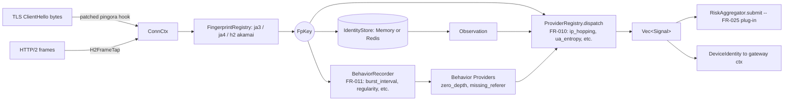

# System Architecture

See also: [Data Storage & Cluster Architecture](./data-storage-architecture.md) for cluster setup, PostgreSQL schema, caching, and operational details.

---

## High-Level Topology

```
┌─────────────────────────────────────────────────────────────┐
│                    Clients (Internet)                        │
└────────────────────────┬────────────────────────────────────┘
                         │
        ┌────────────────┼────────────────┐
        ▼                ▼                ▼
    HTTP/1.1         HTTP/2            HTTP/3 (QUIC)
    (port 80)      (port 443)         (port 443)
        │                │                │
        └────────────────┴────────────────┘
                         │
        ┌────────────────▼────────────────┐
        │      Pingora Reverse Proxy      │
        │   (gateway crate)               │
        │  - TLS termination (OpenSSL)    │
        │  - Load balancing (round-robin) │
        │  - Response caching (moka LRU)  │
        │  - Health checks                │
        │  - RequestFilter chain (phase01)│
        │  - ResponseFilter chain (phase01)
        └────────────────┬────────────────┘
                         │
        ┌────────────────▼────────────────┐
        │    WafEngine (16-phase checks)  │
        │   (waf-engine crate)            │
        │  - IP allow/block               │
        │  - URL patterns                 │
        │  - Rate limiting (CC/DDoS)      │
        │  - Scanner + Bot detection      │
        │  - SQLi/XSS/RCE/Traversal       │
        │  - Custom rules (Rhai/JSON)     │
        │  - OWASP CRS (24 rules)         │
        │  - Sensitive data detection     │
        │  - Anti-hotlink                 │
        │  - CrowdSec integration         │
        │  - Device fingerprinting        │
        │    (FR-010: TLS ClientHello +   │
        │     H2 frame capture)           │
        └────────────────┬────────────────┘
                         │
        ┌────────────────▼────────────────┐
        │   Decision: Allow / Block       │
        │   (WafAction::Allow/Block)      │
        └────────────┬───────────────────┘
                     │
     ┌───────────────┴───────────────┐
     ▼                               ▼
  ALLOW                            BLOCK
     │                               │
     ▼                               ▼
Backend                        Return 403 Forbidden
(upstream                       (or 429 for rate limit)
server)                         Log: security_events +
                                attack_logs
```

---

## Request Lifecycle

Per-request flow runs in five stages:

1. **Pre-Phase — Relay Detection (FR-007)** — `RelayDetector::evaluate` validates XFF / X-Real-IP headers, detects trusted-proxy chains, classifies ASN (residential/datacenter/Tor), and emits signals. Output `ClientIdentity { real_ip, asn_class, asn, signals }` attached to `RequestCtx` for downstream rule predicates.
2. **Pre-Phase — Tier Classification (FR-002)** — `TierPolicyRegistry::classify` resolves `(Tier, Arc<TierPolicy>)` from request parts; result attached to `RequestCtx` before any phase.
3. **Phase-0 — Access Gate (FR-008)** — Host gate → IP blacklist → IP whitelist (per-tier `full_bypass`/`blacklist_only` dispatch). *Future*: IP evaluation to use `ClientIdentity.real_ip` instead of peer IP. Short-circuits before the rule pipeline.
4. **Phases 1–16 — Rule Pipeline** — IP/URL filtering → **FR-004 rate limiting (IP + session keys, token-bucket + sliding-window per tier)** → **FR-005 DDoS detection (per-IP/per-fingerprint/per-tier sliding-window with dynamic banning and graceful degrade)** → **FR-011 behavioral anomaly detection (per-actor cadence/path classifiers, 16-slot ring, signal cap ≤40)** → **FR-012 transaction velocity (session role-tagging, sequence timing, withdrawal bursts)** → payload attacks (SQLi/XSS/RCE/traversal) → custom rules → OWASP CRS → sensitive data → anti-hotlink → CrowdSec. Final decision: Allow / Block / Challenge.
5. **Risk Scoring (FR-025)** — **L0 Seed (Tor/ASN/whitelist baseline) + L1 Accumulation (per-actor state machine, IP/fingerprint/session triple-index with merge-on-collide) + L2 Anomaly (JA4↔UA mismatch, XFF chain, header sanity) + L2 Velocity (sliding window, sequence FSM)**. Risk deltas accumulated from all upstream checks and signals. Decay mechanism reduces stale risk. Thresholds gate: Allow (<X) / Challenge (X–Y) / Block (>Y). Hot-reload config via ArcSwap. Emits `X-WAF-Risk-Score` header. Integrates with tier-specific risk policies.
6. **Post-Decision — FR-009 Smart Caching** — If Allow: tier gate (CRITICAL never cached) → Chain-of-Responsibility gates → store response in moka LRU if eligible (tags indexed for purge).

Full per-phase walkthrough, mermaid diagrams, and post-decision handling: see **[request-pipeline.md](./request-pipeline.md)**.

### Outbound Phase — Response Header Sanitization (FR-035)

When a request is allowed and an upstream response arrives, Pingora invokes
`WafProxy::response_filter` (after the cache layer). If `[outbound] enabled`
is true, the configured `HeaderFilter` walks every response header and
strips:

- **Server-fingerprint** headers — `Server`, `X-Powered-By`, `X-AspNet-Version`,
  `X-AspNetMvc-Version`, `X-Runtime`, `X-Version`, `X-Generator`.
- **Debug / internal** headers — any name with prefix `X-Debug-`, `X-Internal-`,
  `X-Backend-`, `X-Real-IP`, `X-Forwarded-Server`.
- **Error-detail** headers — any name with prefix `X-Error-`, `X-Exception-`,
  `X-Stack-`, `X-Trace-`.
- Optionally: any header whose VALUE matches a PII regex (email, credit card,
  SSN, phone, RFC-1918 IP, JWT). Off by default — adds regex cost per header.

Operator-supplied exact names and prefixes (`strip_headers`, `strip_prefixes`)
extend the built-in lists. Matching is case-insensitive (RFC 9110 §5.1).
Security headers (HSTS, CSP, X-Frame-Options, etc.) are never stripped.

Standards: OWASP ASVS V14.4, CWE-200, CWE-209, RFC 9110 §7.6, NIST SP 800-53 SI-11.

---

## Subsystem Summary

Quick reference for subsystems detailed in dedicated sections below:

| Subsystem | Feature | Module | Purpose |
|-----------|---------|--------|---------|
| **Challenge & PoW** | FR-006 | `waf-engine/challenge/` | Minimal HTML page (<5KB) with JS PoW puzzle; difficulty tiers (easy/medium/hard); nonce store prevents replay |
| **Challenge Credit Tokens** | FR-025 Phase 8 | `waf-engine/risk/challenge_credit/` | Single-use HMAC-signed tokens on PoW completion; bidirectional actor_id binding; verify outcomes (Valid/Invalid/Replay/Expired) with risk deltas |
| **Community Threat Intel** | — | `waf-engine/community/` | Two-way IP blocklist exchange; auto-enrollment with machine_id/api_key; Ed25519 signature verification (fail-closed); batched signal reporter |
| **Logging & Audit** | FR-033 | `waf-engine/logging/` + `prx-waf/victoria_logs/` | VictoriaLogs JSON ingest layer; separate audit sink for non-Allow decisions; batched DB writer; fail-open on buffer saturation |
| **Gateway Filter Chain** | FR-035 | `gateway/filters/` | 6 request filters + 8 response filters; response body chain: decompress → catalog scan → JSON redact → operator regex |

---

## Component Interaction

### Gateway (Pingora) → WafEngine

```rust
// In gateway::proxy.rs
impl ProxyHttp for WafProxy {
    async fn request_filter(&mut self, session: &mut Session) -> Result<()> {
        let req = &session.req_header;
        
        // Build RequestCtx with tier classification (FR-002)
        let mut builder = RequestCtxBuilder::new(session, ...);
        if let Some(registry) = &self.tier_registry {
            builder = builder.with_tier_registry(registry);
        }
        let ctx = builder.build()?;
        // ctx.tier and ctx.tier_policy now populated from TierPolicyRegistry
        
        // Ask WafEngine to check all 16 phases
        let decision = self.engine.check(&ctx).await?;
        
        match decision.action {
            WafAction::Allow => {
                // Continue to backend
                Ok(())
            },
            WafAction::Block => {
                // Return 403 (or 429 based on tier policy)
                session.send_response(403, "Forbidden")?;
                Ok(())
            },
            // ... other actions
        }
    }
}
```

### Gateway → RelayDetector (FR-007)

```rust
// In gateway::proxy.rs, early in request_filter()
let detector = &self.relay_detector;  // RelayDetector instance
let client_identity = detector.evaluate(
    peer_ip,                            // TCP remote address
    &req.headers,                       // HTTP headers (XFF, X-Real-IP, etc.)
    &self.relay_config,                 // RelayConfig (trusted-proxy CIDRs, ASN db)
)?;

// Output: ClientIdentity {
//   real_ip: IpAddr,               // Derived from XFF or fallback to peer_ip
//   asn_class: AsnClass,           // Datacenter / Residential / Tor
//   asn: Option<u32>,              // BGP ASN if found
//   signals: Vec<Signal>,          // XffSpoofPrivate, XffMalformed, ExcessiveHopDepth, TorExit, etc.
// }

// Attach to RequestCtx for rule predicates (FR-025/026)
let mut builder = RequestCtxBuilder::new(session, ...);
builder = builder.with_client_identity(client_identity);
// ... rest of ctx building
```

**Multi-provider architecture:**
- `XffValidator` — parses XFF chain, detects spoofing (private IPs in trusted section)
- `ProxyChainAnalyzer` — counts hop depth, emits `ExcessiveHopDepth` signal if >32
- `AsnClassifier` — mmdb lookup (IPinfo Lite primary, fallback iptoasn TSV)
- `TorExitMatcher` — checks IP against Tor exit node set (refreshed hourly via HTTP+ETag)

**Hot-reload:** File watcher on `rules/relay.yaml` monitors config changes (trusted-proxy CIDRs, ASN db path, Tor feed URL, refresh intervals). Changes propagate via `ArcSwap` (lock-free atomic swap) with ≤1s latency.

### Gateway → DeviceFpDetector (FR-010)

Operator guide: [`device-fingerprinting.md`](device-fingerprinting.md).



```rust
// In gateway::proxy.rs, immediately after RelayDetector
let detector = &self.device_fp_detector;  // Arc<DeviceFpDetector>
let device_identity = detector
    .process(peer_ip, user_agent, &conn_ctx)  // ConnCtx holds raw L4 capture
    .await;

// Output: DeviceIdentity {
//   key: Arc<FpKey>,            // Composite ja3 / ja4 / h2_akamai hashes
//   signals: Vec<Signal>,       // FpConflict, IpHopping, LowEntropyUa, UaBlocklisted, H2Anomaly
// }
```

**Pipeline (`DeviceFpDetector::process`):**
1. `FingerprintRegistry::assemble` → `FpKey` from `RawCapture`.
2. `IdentityStore::observe` (when configured + key non-empty) → `Observation` (sliding-window distinct IPs/UAs).
3. `ProviderRegistry::dispatch` → `Vec<Signal>`.
4. `RiskAggregator::submit` (fire-and-forget) → FR-025 plug-in.

#### FR-025 plug-in contract

`device_fp/` ships `RiskAggregator` (in `crates/waf-engine/src/device_fp/aggregator.rs`) and a `NoopAggregator` default. FR-025 lives in its own crate, implements the trait, and is wired in by the binary:

```rust
use waf_engine::device_fp::{DeviceFpDetector, RiskAggregator, FpKey, Signal};

pub struct ScoringAggregator {
    tx: tokio::sync::mpsc::Sender<Job>,
}

#[async_trait::async_trait]
impl RiskAggregator for ScoringAggregator {
    async fn submit(&self, key: &FpKey, signals: &[Signal]) {
        let job = Job { key: key.clone(), signals: signals.to_vec() };
        if self.tx.try_send(job).is_err() {
            tracing::warn!("risk-scorer queue full, dropping submission");
        }
    }
}

// Wiring:
let detector = DeviceFpDetector::new(cfg, registry)
    .with_store(Arc::new(MemoryIdentityStore::default()))
    .with_aggregator(Arc::new(ScoringAggregator::new()));
```

**Contract rules:**
- `submit` is async but MUST NOT block the caller — fan out to a bounded channel internally and drop-with-warn on overflow.
- Caller treats `submit` as fire-and-forget; no result, no error path.
- `key` is borrowed; clone if the impl retains it past the call.
- `device_fp/` never depends on the FR-025 crate — wiring lives at the binary entry point only.

`LoggingAggregator` (same module) is a test/dev impl that records submissions into a bounded ring buffer for assertions.

### WafEngine → Risk Scorer (FR-025)

**Cumulative risk scoring subsystem** — Tracks per-actor risk state and applies threshold gates to emit Allow / Challenge / Block decisions. Integrates signals from all upstream checks (rule matches, anomalies, DDoS) and decays stale risk. Pluggable backend (memory or Redis).

**L0 seed layer evaluation:** IP reputation baseline (Tor exits, ASN classification, whitelist) evaluated before other risk layers via file-based data sources (`configs/seed/`). Whitelist entries bypass all scoring (immediate Allow).

```
Seed Layer (Tor/ASN/Whitelist) ─────┐
                                    │
Upstream Signals (rules, ddos, etc.)├──► Scorer::score(ctx, fp_key, deltas, now_ms)
    │
    ├─ Build RiskKey (IP, fingerprint, session triple-index)
    │
    ├─ RiskStore::apply(key, deltas, now_ms)
    │   │ (Memory or Redis backend)
    │   ├─ Memory: in-process HashMap with optional decay call
    │   │
    │   └─ Redis: Lua script atomically (single RTT)
    │       ├─ Fetch or create RiskState + owner_id
    │       ├─ Apply decay (raw_score decays by 0-50 points)
    │       ├─ Fold in new contributors (signal deltas)
    │       ├─ Clamp score to [0, 100]
    │       └─ EXPIRE key (per ttl_secs config)
    │
    ├─ Threshold gate: decide(score, tier_policy.risk_thresholds)
    │   ├─ score < allow_threshold    → Allow
    │   ├─ score < challenge_threshold → Challenge (CAPTCHA, JS POW)
    │   └─ score >= challenge_threshold → Block
    │
    └─ Emit X-WAF-Risk-Score header + return WafAction
```

**RiskKey triple-index (collision & merge strategy):**
- IP-based: `waf:risk:idx:ip:{client_ip}` (Redis) or memory key
- Fingerprint-based: `waf:risk:idx:fp:{fp_hash}` (Redis) or memory key
- Session-based: `waf:risk:idx:sid:{session_id}` (Redis) or memory key

When multiple keys match a single request, all three states merge via `force_max_script` (Redis) or in-memory merge (highest score wins, contributors union).

**Backend Configuration (Phase 7)**

| Aspect | Memory | Redis |
|--------|--------|-------|
| **Deployment** | Single-node / dev | Cluster / high-volume |
| **Storage** | In-process HashMap | Distributed key-value |
| **Persistence** | Lost on restart | Persisted (RDB/AOF) |
| **Consistency** | Per-request local | Atomic Lua scripts |
| **Failover** | N/A | Circuit breaker + LRU fallback |
| **Config** | `store.backend = "memory"` | `store.backend = "redis"` + redis.* |

**Redis Lua Scripts (Atomic Operations)**
1. `apply_script` — Decay + fold deltas + EXPIRE in single RTT
2. `mint_or_get_owner_script` — Idempotent owner_id creation (UUID v4)
3. `force_max_script` — Merge colliding keys by score (used during incident response)

**Circuit Breaker & Fail-Open (Redis Only)**
- Opens after `breaker_threshold` (default: 5) consecutive failures
- Falls back to in-memory LRU cache (`cache_capacity`, default: 10k)
- Requests proceed with local cache; Redis resync on next success
- No request blocking during Redis outage

**L2 Anomaly Layer (Phase 5):** Inline synchronous detectors evaluated per-request: (1) JA4↔UA mismatch (TLS fingerprint vs User-Agent family incompatibility, +20), (2) XFF chain sanity (malformed or excessive hop counts, +10 cap), (3) Header sanity (missing required headers or impossible combinations, +15 cap).

**L2 Velocity Layer (Phase 5):** Request-rate and transaction-sequence detectors: (1) Sliding window (60×1s ring buffer; request-rate threshold breach → +25), (2) Sequence FSM (Login→OTP→Withdrawal path validation; out-of-order or timing anomalies → +30).

**Risk contributions:**
- Rule matches (e.g., SQLi detected) — delta from `rule.risk_score_delta` in YAML (0–50 points)
- Signal providers (FR-010, FR-011, FR-012 anomalies) — delta from signal enum (5–20 points)
- DDoS detector verdicts (FR-005) — delta bump for detected floods (5–30 points)
- L2 Anomaly detectors (JA4↔UA, XFF, headers) — delta 10–20 points
- L2 Velocity detectors (sliding window, sequence FSM) — delta 25–30 points

**Decay mechanism:**
- Linear decay: `raw_score -= decay_factor * time_ms` (configurable, default 1 pt/min)
- Floor: score never drops below 0 or above 100
- Clean streak: increments when no new signals in a window (soft reset threshold)

**Configuration (hot-reload via `configs/risk.yaml`):**
```yaml
[risk]
enabled = true
decay_enabled = true
decay_factor_per_min = 1.0        # Points lost per minute of inactivity
allow_threshold = 30              # Risk score below this → Always Allow
challenge_threshold = 60          # Risk score [allow, challenge) → Challenge
use_ip_key = true
use_fingerprint_key = true
use_session_key = true            # Requires session cookie / FR-010 FpKey
max_state_age_secs = 3600         # Purge risk states older than this
```

**Integration points:**
- **During rule evaluation** (Phase N) — Accumulate risk deltas in `RequestCtx.risk_deltas`
- **Post-rule pipeline** — `Scorer::score()` applies accumulated deltas + applies decay + thresholds
- **Header emission** — `X-WAF-Risk-Score: <0-100>` sent in all responses
- **Tier policy** — `tier_policy.risk_thresholds` (allow/challenge/block points) per tier

**Module:** `crates/waf-engine/src/risk/` (scorer.rs, key.rs, state.rs, score.rs, decay.rs, threshold.rs, config.rs, reload.rs, store/, seed/, anomaly/, velocity/, ingest/, tests/).

### WafEngine → PostgreSQL Storage

```rust
// In waf-engine::engine.rs
pub struct WafEngine {
    pub store: Arc<RuleStore>,           // In-memory registry
    pub db: Arc<Database>,               // PostgreSQL connection pool
    pub custom_rules: Arc<CustomRulesEngine>,
}

// On startup: load rules from disk + database
async fn init(db: Arc<Database>) -> Result<Self> {
    // Load built-in YAML rules from disk
    let yaml_rules = load_yaml_rules("rules/")?;
    
    // Load custom rules from PostgreSQL
    let custom_rules = db.list_custom_rules().await?;
    
    // Build RuleRegistry (in-memory)
    let registry = RuleRegistry::new();
    for rule in yaml_rules.chain(custom_rules) {
        registry.insert(rule);
    }
    
    Ok(Self {
        store: Arc::new(RuleStore { registry }),
        db,
        custom_rules: Arc::new(CustomRulesEngine::new()),
    })
}

// During request: write to database
async fn log_attack(&self, event: SecurityEvent) -> Result<()> {
    self.db.create_security_event(event).await?;
    Ok(())
}
```

### WafAPI → Database → Admin UI

```
Admin UI (Vue 3)
    │
    ├─ POST /api/hosts  ────────────►  Axum Router
    │                                      │
    │                                      ▼
    │                             JWT Auth Middleware
    │                                      │
    │                                      ▼
    │                             Handler: create_host()
    │                                      │
    │                                      ▼
    │                             Database: db.create_host()
    │                                      │
    │                                      ▼
    │                             PostgreSQL: INSERT INTO hosts
    │                                      │
    │  ◄──── JSON Response ────────────────┘
```

### WafEngine → Data File Registry (Hot-Reload .data Files)

**v1.0.0 Feature**: Automatic hot-reload of external data files (dictionaries, Aho-Corasick patterns) without downtime.

```
File System (.data files)
    │
    ├─ rules/payloads.data ─┐
    ├─ rules/wordlist.data  ├──► File Watcher (notify crate, 500ms debounce)
    └─ rules/patterns.data  │
                            ▼
                      DataFileRegistry
                            │
        ┌───────────────────┼───────────────────┐
        ▼                   ▼                   ▼
    Cache Hit          Parse & Compile      Error Handler
    (mtime+size            (Aho-Corasick)      (log, retain
     match)              (10 MiB cap,         previous)
                         100K patterns)
        │                   │                   │
        └───────────────────┼───────────────────┘
                            ▼
                      Arc<DashMap<Key, Automaton>>
                            │
                      Request-time
                      pm_from_file / contains_any
                      operators access via
                      registry.load_or_get(path)
```

**Design**:
- Cache key: `(canonicalized_path, mtime, size)` — detects file changes via fs metadata
- Lock-free reads: Request-path uses cheap `Arc` clone (no mutex)
- Lazy compilation: Automaton built only on first request, reused across invocations
- Size limits: 10 MiB per file (soft warn ≥50k entries), hard-reject ≥500k
- Hot-reload integration: File watcher thread detects changes, invalidates cache, recompiles in background
- Fail-safe: Parse errors logged at WARN; previous automaton retained if new compile fails

**Modules**:
- `crates/waf-engine/src/rules/data_file_registry.rs` — Registry + caching logic
- `crates/waf-engine/src/rules/data_file_resolver.rs` — Path resolution, `.data` file discovery
- `crates/waf-engine/src/rules/load_status.rs` — Error tracking (MissingDataFile, InvalidRegex, etc.)
- `crates/waf-engine/src/rules/metrics.rs` — `classify_error()` stable metric labels

### Rule Load Status Reporting

**v1.0.0 Feature**: Structured tracking of rule load failures with observability.

```
Rule Load Operation
    │
    ├─ File parse → JSON error → classify_error() → RuleLoadStatus::ParseError
    ├─ Regex compile → invalid pattern → RuleLoadStatus::InvalidRegex
    ├─ Data file missing → path not found → RuleLoadStatus::MissingDataFile
    ├─ Path traversal → ../../../etc/passwd → RuleLoadStatus::PathTraversal
    ├─ I/O failure → disk error → RuleLoadStatus::IoError
    └─ Compile error → check logic failure → RuleLoadStatus::CompileError
                           ▼
                    RuleLoadReport
                    (id, timestamp, status)
                           ▼
            Metrics (stable labels)
            rule_load_errors_total{status="invalid_regex"}
            rule_load_duration_ms
```

**Benefits**:
- Graceful degradation: Load failures don't crash pipeline
- Observability: Metric labels stable across all load scenarios
- Troubleshooting: Clear status classification aids root-cause analysis

**Integration**: Rule reload (via file watcher or API) invokes `classify_error()` to emit consistent metrics.

### Cluster Mode (Optional 3-Node HA)

QUIC mTLS mesh with automatic leader election, rule sync, event forwarding, config sync, and write forwarding.

```
Main Node (control plane)
├── PostgreSQL storage (authoritative)
├── RuleRegistry + RuleChangelog
├── Admin API (read-write)
└── QUIC server
    ├── handles RuleSyncRequest → returns incremental/snapshot
    ├── receives EventBatch → batch INSERT to DB
    ├── broadcasts ConfigSync (TOML, version-gated, term-fenced)
    └── replays ApiForward → returns ApiForwardResponse

Worker Nodes (data plane)
├── In-memory RuleRegistry (synced from main)
├── Admin API (read-only; writes forwarded via QUIC)
├── EventBatcher → forwards SecurityEvents to main
└── QUIC client
    ├── periodic RuleSyncRequest (pull model)
    ├── receives ConfigSync → apply (proxy/rules/cache/api sections)
    └── ApiForward for write requests (1MB payload limit, 10s timeout)
```

**Key flows:**

1. **Rule sync** — Workers poll main every `rules_interval_secs`. Main responds with incremental delta (from `RuleChangelog` ring buffer) or lz4-compressed full snapshot. Workers apply to in-memory `RuleRegistry` and call `RuleReloader::reload_from_registry()` (no DB needed on workers).

2. **Event forwarding** — Workers batch `SecurityEvent`s (configurable size/interval) via `EventBatcher`. Main persists with batch INSERT, tags `source_node_id` to prevent double-counting.

3. **Config sync** — Main broadcasts `ConfigSync` with TOML-serialized `SyncableConfig` (proxy, rules, cache, api sections only — never overwrites cluster/storage). Includes election `term` for stale-main rejection.

4. **Write forwarding** — Worker API middleware intercepts POST/PUT/DELETE/PATCH, serializes to `ApiForward`, sends via QUIC. Main replays via HTTP, returns `ApiForwardResponse`. Workers return 503 if main unreachable.

5. **Transport dispatch** — All 13 `ClusterMessage` variants dispatched exhaustively (no catch-all) in both server and client. `NodeState` bridges to `WafEngine` via `Arc<dyn RuleReloader>`.

**Module:** `crates/waf-cluster/` (transport/, sync/, node.rs, cluster_forward.rs, lib.rs).

---

## Challenge & Proof-of-Work System (FR-006)

Risk score >= challenge_threshold triggers minimal (<5KB) HTML page with embedded JS PoW puzzle.

```
Risk Scorer (challenge_threshold breach)
    ├─ DifficultyMap::select(score) → DifficultyTier
    ├─ JsChallengeRenderer::render() → nonce + page
    └─ Nonce store (in-memory LRU) + verify_pow()
    │
Client solves PoW → POST /retry with cookie
    │
    ├─ PowVerifyResult (Valid → issue token | Invalid/Replay → +risk)
    └─ Token signed via HMAC-SHA256(secret, actor_id || nonce)
```

**Key types:** `ChallengeConfig`, `DifficultyMap`, `PowSolution`, `JsChallengeRenderer`.

**Module:** `crates/waf-engine/src/challenge/`.

---

## Challenge Credit Tokens (FR-025 Phase 8)

After PoW success, issue single-use HMAC-signed token (secret: `/var/lib/waf/challenge-hmac.key`).

**Verify Outcomes:**
| Outcome | Risk Delta | Condition |
|---------|-----------|-----------|
| Valid | -25 | Signature OK + nonce unused + TTL valid |
| Invalid | +20 | Signature mismatch |
| Replay | +30 | Nonce already consumed |
| Expired | +10 | Token TTL exceeded |

Token binds bidirectionally: actor_id must match in token and request. Nonce store (in-memory LRU) prevents replay.

**Module:** `crates/waf-engine/src/risk/challenge_credit/`.

---

## Community Threat Intelligence

Two-way IP blocklist + detection signal exchange. Auto-enroll (machine_id/api_key) on first run.

**Inbound (blocklist check):**
- Periodic sync (configurable interval, default 5min)
- Ed25519 signature verification (fail-closed if public_key invalid)
- In-memory cache lookup → +40 risk delta if hit

**Outbound (report detections):**
- Batched HTTP POST (signal type: SQLi, XSS, DDoS, etc.)
- Configurable batch size + flush interval
- Background flush task, fail-open on network errors

**Module:** `crates/waf-engine/src/community/`.

---

## Logging & Audit Subsystem (FR-033)

Two independent layers sharing batch-buffer abstraction:

**VictoriaLogs Layer:** All `tracing` events → JSON to HTTP endpoint (batch: 1000 events or 5s).

**Audit Layer:** Non-Allow decisions (Block/Challenge/Redirect) → PostgreSQL (batch: 500 events or 10s).

**VictoriaLogs Sidecar:** Auto-downloaded from GitHub (SHA-256 verified), runs as managed child process, listens on :9428.

**Fail-Open:** Buffer saturation or network errors drop entries (never block WAF path). DB connection failure → WARN + continue.

**Module:** `crates/waf-engine/src/logging/` + `crates/prx-waf/src/victoria_logs/`.

---

## Gateway Filter Chain

Trait-based Chain-of-Responsibility for request/response processing.

**Request Filters:** ForwardedHost, ForwardedProto, HopByHop, HostPolicy, RealIp, Xff.

**Response Filters:** BodyDecompressor → BodyContentScanner (audit) → JsonFieldRedactor (FR-034) → HeaderBlocklist → LocationRewriter, ServerPolicy, ViaStrip.

**Response Body Chain:** Decompress → catalog PII/secrets (emit FR-033 audit) → redact JSONPath fields → operator regex.

**Module:** `crates/gateway/src/filters/`.

---

## Security Check Pipeline (11 Checks)

All checks run async, deltas accumulate → FR-025 scorer.

| Check | Feature | Risk |
|-------|---------|------|
| BruteForce | FR-018 | +50 failed auth; -20 success |
| Ssrf | FR-016 | +35 (metadata IP); +20 (obfuscated) |
| HeaderInjection | FR-017 | +25 (CRLF); +30 (Host bypass) |
| BodyAbuse | FR-020 | +10–20 (oversized/depth/explosion) |
| SqlInjection | — | +40 (libinjection) |
| Xss | — | +30 (script/event handler) |
| Rce | — | +50 (shell metachar) |
| DirTraversal | — | +35 (%2e%2e%2f) |
| Scanner | — | +20 (known scanner UA) |
| Geo | — | +5–15 (policy) |
| AntiHotlink | — | +10 (missing Referer) |

**Module:** `crates/waf-engine/src/checks/`.

---

## CrowdSec Integration (3 Modes)

**Bouncer:** IP reputation cache (LRU, configurable TTL) → Allow or Block per policy.

**AppSec:** Async HTTP check against AppSec endpoint (remote_addr, user_agent, rule_hit context) → Allow, Block, or Captcha.

**Both:** Combine both modes.

**Background Tasks:** Sync (periodic decision polling + cache eviction), Pusher (batched logs to LAPI).

**Circuit Breaker:** Fallback to allow-all if LAPI unreachable; recover on success.

**Module:** `crates/waf-engine/src/crowdsec/`.

---

## RequestCtx Population Order

1. **RelayDetector** — XFF/X-Real-IP evaluation → `client_ip`
2. **TierPolicyRegistry** — host/path classification → `tier` + `tier_policy`
3. **GeoIP** — lookup → `geo` (optional)
4. **Tier Cache Gate** — URL-based cache eligibility check
5. **11 Checks** — async, deltas accumulate in `RequestCtx.risk_deltas`
6. **Risk Scorer** — thresholds (allow_threshold, challenge_threshold) → Allow/Challenge/Block
7. **Audit Sink** — FR-033 event emission for non-Allow decisions

**Key fields:** `client_ip`, `method`, `path`, `headers`, `body_preview`, `host_config`, `geo`, `tier`, `tier_policy`, `cookies` (pre-parsed).

