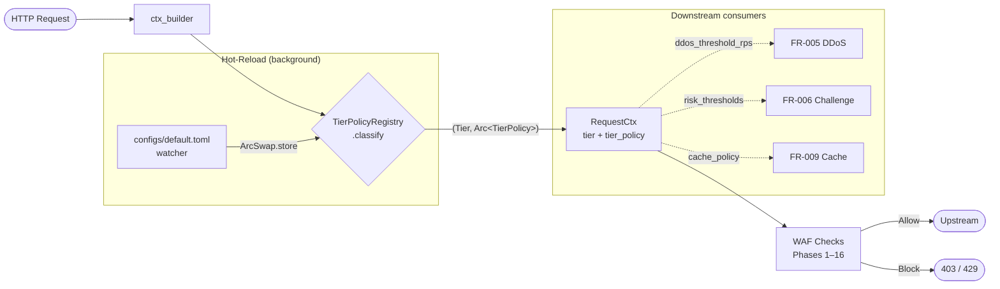

# System Architecture

## High-Level Topology

```
┌─────────────────────────────────────────────────────────────┐
│                    Clients (Internet)                        │
└────────────────────────┬────────────────────────────────────┘
                         │
        ┌────────────────┼────────────────┐
        ▼                ▼                ▼
    HTTP/1.1         HTTP/2            HTTP/3 (QUIC)
    (port 80)      (port 443)         (port 443)
        │                │                │
        └────────────────┴────────────────┘
                         │
        ┌────────────────▼────────────────┐
        │      Pingora Reverse Proxy      │
        │   (gateway crate)               │
        │  - TLS termination (OpenSSL)    │
        │  - Load balancing (round-robin) │
        │  - Response caching (moka LRU)  │
        │  - Health checks                │
        │  - RequestFilter chain (phase01)│
        │  - ResponseFilter chain (phase01)
        └────────────────┬────────────────┘
                         │
        ┌────────────────▼────────────────┐
        │    WafEngine (16-phase checks)  │
        │   (waf-engine crate)            │
        │  - IP allow/block               │
        │  - URL patterns                 │
        │  - Rate limiting (CC/DDoS)      │
        │  - Scanner + Bot detection      │
        │  - SQLi/XSS/RCE/Traversal       │
        │  - Custom rules (Rhai/JSON)     │
        │  - OWASP CRS (24 rules)         │
        │  - Sensitive data detection     │
        │  - Anti-hotlink                 │
        │  - CrowdSec integration         │
        └────────────────┬────────────────┘
                         │
        ┌────────────────▼────────────────┐
        │   Decision: Allow / Block       │
        │   (WafAction::Allow/Block)      │
        └────────────┬───────────────────┘
                     │
     ┌───────────────┴───────────────┐
     ▼                               ▼
  ALLOW                            BLOCK
     │                               │
     ▼                               ▼
Backend                        Return 403 Forbidden
(upstream                       (or 429 for rate limit)
server)                         Log: security_events +
                                attack_logs
```

---

## Request Lifecycle (16-Phase Pipeline)

### Pre-Phase: Tier Classification (FR-002)

```
Tier Classification:
├─ RequestCtx populated in gateway::ctx_builder
├─ TierPolicyRegistry::classify(&request_parts) runs
├─ Returns (Tier, Arc<TierPolicy>) from current snapshot
├─ ctx.tier and ctx.tier_policy set before Phase 1
└─ All downstream phases read tier for policy-aware decisions
   (e.g., rate-limit threshold, block action per tier)
```

**Default**: If no tier registry configured at boot, uses `Tier::CatchAll` + permissive policy (fallback mode).

**Wired in**: `prx-waf/src/main.rs::try_init_tier_registry()` loads config, spawns `TierConfigWatcher` for hot-reload, injects registry into gateway.

#### Tier Flow Diagram



---

### Phases 1-4: IP & URL Filtering

```
Phase 1: IP Allowlist (CIDR)
├─ Check if client IP in allow_ips table
├─ If match → allow this phase, continue to Phase 2
└─ If no match → continue (allowlist is permissive)

Phase 2: IP Blocklist (CIDR)
├─ Check if client IP in block_ips table
├─ If match → BLOCK (decision made)
└─ If no match → continue to Phase 3

Phase 3: URL Allowlist (regex + literal)
├─ Check if request path in allow_urls table
├─ If match → bypass all downstream phases, allow
└─ If no match → continue to Phase 4

Phase 4: URL Blocklist (regex + literal)
├─ Check if request path in block_urls table
├─ If match → BLOCK
└─ If no match → continue to Phase 5
```

### Phases 5-7: Rate Limiting & Behavior Analysis

```
Phase 5: CC/DDoS Rate Limiting
├─ Per-IP sliding-window counter
├─ Increment on each request
├─ If counter > threshold → BLOCK (or challenge)
└─ else → continue to Phase 6

Phase 6: Scanner Detection
├─ Check User-Agent against scanner fingerprints (Nmap, Nikto, etc.)
├─ Check request patterns (unusual paths, SQL comments in URI, etc.)
├─ If scanner detected → log & continue (or block, configurable)
└─ else → continue to Phase 7

Phase 7: Bot Detection
├─ Check User-Agent against known bot list (headless browsers, etc.)
├─ Check for browser fingerprinting anomalies
├─ If malicious bot → BLOCK (or challenge)
└─ else → continue to Phase 8
```

### Phases 8-11: Payload Attack Detection

```
Phase 8: SQL Injection (SQLi)
├─ Parse request body + query string (up to 256KB JSON)
├─ Run libinjectionrs detect_sqli fingerprint engine
├─ Check 19 modular regex patterns (SQLI-001..019: classic, blind, error-based)
├─ Apply SqliScanConfig (header/JSON toggles, denylist/allowlist, 4KB header cap)
├─ If SQL injection payload detected → BLOCK
└─ else → continue to Phase 9

Phase 9: Cross-Site Scripting (XSS)
├─ Parse request body + headers
├─ Run libinjectionrs detect_xss fingerprint engine
├─ Check compiled XSS regex patterns (script tags, event handlers, etc.)
├─ If JavaScript/HTML injection detected → BLOCK
└─ else → continue to Phase 10

Phase 10: Remote Code Execution (RCE)
├─ Check for command injection patterns (shell metacharacters, etc.)
├─ Check for expression language injection (${}, #{}, etc.)
├─ Check for template injection (Jinja2, Freemarker, etc.)
├─ If RCE pattern detected → BLOCK
└─ else → continue to Phase 11

Phase 11: Directory Traversal
├─ Normalize path (decode, resolve ../)
├─ Check for attempts to escape web root
├─ Check for Windows alternate data streams (::$DATA)
├─ If traversal detected → BLOCK
└─ else → continue to Phase 12
```

### Phases 12-16: Advanced & Custom Rules

```
Phase 12: Custom Rules (User-Defined)
├─ Load from custom_rules table (Rhai scripts + JSON DSL)
├─ Execute Rhai scripts in sandboxed environment
├─ Evaluate JSON DSL conditions
├─ If rule matches → action (block/log/challenge)
└─ else → continue to Phase 13

Phase 13: OWASP CRS (Core Rule Set)
├─ 24 pre-compiled rule patterns
├─ Categories: XSS, SQLi, RCE, RFI, LFI, protocol violations, etc.
├─ If CRS rule matches → action (block/log)
└─ else → continue to Phase 14

Phase 14: Sensitive Data Leakage
├─ Aho-Corasick multi-pattern matching
├─ Patterns: credit card numbers, SSN, API keys, passwords, etc.
├─ If sensitive data in request → log & continue (or block)
└─ else → continue to Phase 15

Phase 15: Anti-Hotlink Protection
├─ Check Referer header
├─ If Referer not in allowed list → BLOCK (return 403)
└─ else → continue to Phase 16

Phase 16: CrowdSec Integration
├─ Query CrowdSec bouncer for active decisions on client IP
├─ If IP has active decision (ban, captcha, etc.) → apply action
├─ If IP is in local cache → use cached decision
├─ Push attack logs to CrowdSec Log Pusher
└─ FINAL DECISION: Allow / Block / Challenge
```

### Post-Decision

```
After Phase 16:
├─ Decision = Allow
│  ├─ Route to backend (vhost → load balancer → upstream)
│  ├─ Receive response from backend
│  ├─ Store in response cache (if eligible)
│  └─ Return response to client
│
├─ Decision = Block
│  ├─ Return HTTP 403 Forbidden
│  ├─ Log to security_events + attack_logs
│  ├─ Send notifications (email, webhook, etc.)
│  └─ Increment blocked_requests counter
│
└─ Decision = Challenge
   ├─ Return HTTP 429 Too Many Requests (or CAPTCHA page)
   ├─ Log to security_events
   └─ Wait for client to solve challenge before allowing
```

---

## Component Interaction

### Gateway (Pingora) → WafEngine

```rust
// In gateway::proxy.rs
impl ProxyHttp for WafProxy {
    async fn request_filter(&mut self, session: &mut Session) -> Result<()> {
        let req = &session.req_header;
        
        // Build RequestCtx with tier classification (FR-002)
        let mut builder = RequestCtxBuilder::new(session, ...);
        if let Some(registry) = &self.tier_registry {
            builder = builder.with_tier_registry(registry);
        }
        let ctx = builder.build()?;
        // ctx.tier and ctx.tier_policy now populated from TierPolicyRegistry
        
        // Ask WafEngine to check all 16 phases
        let decision = self.engine.check(&ctx).await?;
        
        match decision.action {
            WafAction::Allow => {
                // Continue to backend
                Ok(())
            },
            WafAction::Block => {
                // Return 403 (or 429 based on tier policy)
                session.send_response(403, "Forbidden")?;
                Ok(())
            },
            // ... other actions
        }
    }
}
```

### WafEngine → PostgreSQL Storage

```rust
// In waf-engine::engine.rs
pub struct WafEngine {
    pub store: Arc<RuleStore>,           // In-memory registry
    pub db: Arc<Database>,               // PostgreSQL connection pool
    pub custom_rules: Arc<CustomRulesEngine>,
}

// On startup: load rules from disk + database
async fn init(db: Arc<Database>) -> Result<Self> {
    // Load built-in YAML rules from disk
    let yaml_rules = load_yaml_rules("rules/")?;
    
    // Load custom rules from PostgreSQL
    let custom_rules = db.list_custom_rules().await?;
    
    // Build RuleRegistry (in-memory)
    let registry = RuleRegistry::new();
    for rule in yaml_rules.chain(custom_rules) {
        registry.insert(rule);
    }
    
    Ok(Self {
        store: Arc::new(RuleStore { registry }),
        db,
        custom_rules: Arc::new(CustomRulesEngine::new()),
    })
}

// During request: write to database
async fn log_attack(&self, event: SecurityEvent) -> Result<()> {
    self.db.create_security_event(event).await?;
    Ok(())
}
```

### WafAPI → Database → Admin UI

```
Admin UI (Vue 3)
    │
    ├─ POST /api/hosts  ────────────►  Axum Router
    │                                      │
    │                                      ▼
    │                             JWT Auth Middleware
    │                                      │
    │                                      ▼
    │                             Handler: create_host()
    │                                      │
    │                                      ▼
    │                             Database: db.create_host()
    │                                      │
    │                                      ▼
    │                             PostgreSQL: INSERT INTO hosts
    │                                      │
    │  ◄──── JSON Response ────────────────┘
```

---

## Data Flow (In-Memory vs Storage)

### Configuration (Startup → Runtime)

```
config.toml (disk)
    │
    ▼
AppConfig struct (parsed by toml crate)
    │
    ▼
Arc<AppConfig> (shared, immutable)
    │
    ├─► Pingora (proxy config)
    ├─► WafEngine (rule config, check params)
    ├─► WafAPI (API config, CORS, auth)
    └─► WafCluster (cluster config, election params)
```

**Note**: No runtime config changes. Changes require restart.

### Rules (Disk + Database → In-Memory)

```
Disk (rules/*.yaml)  ──┐
                       │
Database (custom_rules) ──► RuleRegistry (Arc<RwLock>)
                       │        │
                       │        ├─► On every request: check()
                       │        │
                       │        └─► Hot-reload: reload_rules()
                       │
File watcher (notify) ─┘
```

**Cache**: Rules versioned (u64). Workers sync incremental diffs.

### Logs (Per-Request → Batch → Database)

```
WafEngine.check() → decision

If Block:
    event = SecurityEvent {
        timestamp,
        client_ip,
        rule_id,
        action,
        path,
        ...
    }
    
    db.create_security_event(event).await?
        │
        ▼
    PostgreSQL: security_events table
        │
        ▼
    (Async) db.broadcast(event)  ──► WebSocket subscribers (/ws/events)
```

### Statistics (In-Memory Counter → Database)

```
RequestStats (parking_lot::Mutex) ──┐
    total_requests: u64              │
    blocked_requests: u64            │
    top_rules: DashMap               │
    top_ips: DashMap                 │
    top_countries: DashMap           │
                                     │
                        ┌────────────┘
                        │
                        ▼ (every 30s via tokio::time::interval)
                        
                    db.update_stats()
                        │
                        ▼
                    PostgreSQL: request_stats table
```

---

## Cluster Architecture

### Single-Node (Standalone)

```
┌─────────────────────────┐
│   PRX-WAF Process       │
├─────────────────────────┤
│ Pingora (proxy)         │
│ WafEngine (checks)      │
│ WafAPI (admin UI)       │
│ PostgreSQL Client       │
└─────────────────────────┘
         │
         ▼
   PostgreSQL 16+
```

### 3-Node Cluster (High Availability)

```
                  QUIC mTLS Mesh (port 16851)
                    ┌──────────────────┐
                    │                  │
        ┌───────────▼──────────┐       │
        │    Node A (Main)     │       │
        ├──────────────────────┤       │
        │ Pingora proxy        │───────┼─────────┐
        │ WafEngine            │       │         │
        │ WafAPI (read-write)  │       │         │
        │ PostgreSQL client    │       │         │
        │ Role: control plane  │       │         │
        └──────────┬───────────┘       │         │
                   │                   │         │
                   ▼                   │         │
            PostgreSQL 16+             │         │
           (primary)                   │         │
                   ▲                   │         │
                   │                   │         │
           ┌───────┴───────┐           │         │
           │               │           │         │
   ┌───────▼──────────┐ ┌──▼──────────▼──────┐  │
   │  Node B (Worker) │ │  Node C (Worker)   │  │
   ├──────────────────┤ ├────────────────────┤  │
   │ Pingora proxy    │ │ Pingora proxy      │  │
   │ WafEngine        │ │ WafEngine          │  │
   │ WafAPI (fwd)     │ │ WafAPI (fwd)       │  │
   │ RuleRegistry     │ │ RuleRegistry       │  │
   │ Role: data plane │ │ Role: data plane   │  │
   │ (no DB)          │ │ (no DB)            │  │
   └────────┬─────────┘ └──────────┬─────────┘  │
            │                      │            │
            │ Write requests       │            │
            │ forwarded to main    │            │
            └──────────┬───────────┘            │
                       │                        │
                       ▼                        │
         ┌─ Main's API handler ◄───────────────┘
         │ (via QUIC ApiForward stream)
         │
         ▼
    Persists to PostgreSQL
    Broadcasts to other nodes
```

**Data Flow in Cluster:**

1. **Worker receives request** → checks rules (in-memory RuleRegistry)
2. **Admin edits rule on main** → main writes to PostgreSQL
3. **Rule sync triggers** → main sends RuleSyncResponse to all workers
4. **Worker receives rule update** → updates in-memory RuleRegistry (version++)
5. **Worker processes request** → uses updated rule (no downtime)

### Leader Election (Raft-Lite)

```
Node A (Main)          Node B (Worker)        Node C (Worker)
    │                      │                       │
    │──────── heartbeat ───────────►               │
    │                      │                       │
    │                      ◄──── heartbeat ack ────┤
    │
    ├─ If no heartbeat from A within 150-300ms:
    │
    └─► Become Candidate
        ├─ Increment term (e.g., 5 → 6)
        ├─ Vote for self
        ├─ Send ElectionVote to all peers
        │
        B & C receive ElectionVote(term=6, candidate=B)
        ├─ Grant vote (if term > current term)
        ├─ Send ElectionResult back
        │
        B receives 2 votes (self + C)
        ├─ Majority reached (2/3)
        ├─ Become Main
        ├─ Broadcast ElectionResult(term=6, elected=B)
        │
        C receives ElectionResult
        └─ Demote to Worker, accept B as Main
```

**Election Timeline:**
- Detection: <150ms (if main dies suddenly)
- Voting round: <100ms
- New main operational: <500ms total

---

## Storage Layer (PostgreSQL)

### Schema Overview

**Configuration Tables**
- `hosts` — Virtual host config (upstream, ports, LB backends, SSL)
- `allow_ips`, `block_ips` — IP CIDR lists
- `allow_urls`, `block_urls` — URL patterns
- `certificates` — TLS certificates (Let's Encrypt + custom)
- `custom_rules` — User-created rules (Rhai/JSON)
- `sensitive_patterns` — PII/credential keywords
- `load_balance_backends` — Backend servers
- `hotlink_config` — Anti-hotlink rules per host

**Security Tables**
- `security_events` — Rule match events (10K+ rows/day in production)
- `attack_logs` — Full attack payloads + geo (100K+ rows/day)
- `request_stats` — Aggregated metrics (RPS, top rules, top IPs, top countries)

**Admin Tables**
- `admin_users` — Username, password hash (Argon2), TOTP secret (encrypted)
- `refresh_tokens` — JWT refresh tokens + expiry
- `audit_log` — Admin action history (who did what, when)

**Cluster Tables**
- `cluster_nodes` — Peer metadata (role, last_heartbeat, rules_version)
- `cluster_sync_queue` — Pending updates to workers
- `cluster_ca_key` — Encrypted CA private key (AES-GCM)

**Integration Tables**
- `plugins` — WASM plugin binaries (code, checksum, enabled)
- `tunnels` — Reverse tunnel configs (client_id, key, allowed_paths)
- `crowdsec_cache` — Bouncer decision cache (IP, action, ttl)
- `notifications` — Alert channels (email, webhook, telegram)

### Indexes for Performance

```sql
CREATE INDEX idx_security_events_timestamp ON security_events(timestamp DESC);
CREATE INDEX idx_security_events_rule_id ON security_events(rule_id);
CREATE INDEX idx_attack_logs_client_ip ON attack_logs(client_ip);
CREATE INDEX idx_request_stats_timestamp ON request_stats(timestamp DESC);
```

---

## Caching Strategy

### Response Cache (moka LRU)

**What's cached?**
- Static content (CSS, JS, images)
- API responses (if Cache-Control header allows)
- Size limit: 256 MB (configurable)
- TTL: 60s default (configurable per host)

**Cache bypass:**
- Authenticated requests (Authorization header) — not cached
- Set-Cookie in response — not cached
- Cache-Control: no-cache, no-store — respected
- Cookies in request → different cache key

**Key:** `host + path + query_string`

### Rule Cache (In-Memory)

**RuleRegistry** (Arc<RwLock>)
- All rules loaded at startup (from disk + database)
- No TTL; rules persist until explicitly updated
- Hot-reload: atomic swap of entire registry
- Workers sync from main: incremental updates or full snapshot

### Statistics Cache (In-Memory)

**RequestStats** (parking_lot::Mutex)
- Counters incremented on every request (zero-copy)
- Flushed to PostgreSQL every 30s
- DashMap for top-N tracking (top 100 IPs, top 100 rules, etc.)

### Bouncer Cache (PostgreSQL + In-Memory)

**CrowdSec decisions**
- Query LAPI on each active decision
- Cache in PostgreSQL (crowdsec_cache) with TTL
- In-memory DashMap for fast lookups
- Fallback action if LAPI unreachable (configurable)

---

## Admin UI Architecture

### Technology Stack

- **Vue 3** (3.3.13) — Framework
- **Vite** (5.1.3) — Dev server + bundler
- **Tailwind** (3.4.1) — Styling
- **Pinia** (2.1.7) — State management (auth.ts)
- **vue-router** (4.2.5) — Client-side routing (hash mode)
- **axios** (1.6) — HTTP client (JWT interceptor)
- **vue-i18n** (9.14.5) — Internationalization (11 locales)
- **lucide-vue-next** (0.577) — Icon library
- **TypeScript** (5.3) — Type safety

### View Structure (21 pages)

| Path | Purpose |
|------|---------|
| `/login` | JWT + TOTP authentication |
| `/dashboard` | Overview: RPS, top attacks, blocked %, geo heatmap |
| `/hosts` | Vhost CRUD (backend config, SSL, LB) |
| `/ip-rules` | IP allow/block lists (CIDR CRUD) |
| `/url-rules` | URL allow/block patterns (regex CRUD) |
| `/rules` | Built-in rules (enable/disable, info) |
| `/custom-rules` | User-defined rules (Rhai/JSON editor) |
| `/certificates` | TLS cert management (Let's Encrypt, manual) |
| `/security-events` | Real-time attack stream (WebSocket) |
| `/attack-logs` | Historical attacks (export as CSV/JSON) |
| `/cc-protection` | Rate limiting config |
| `/bot-detection` | Bot rule management |
| `/sensitive-patterns` | PII pattern management |
| `/notifications` | Alert channels (email, webhook, telegram) |
| `/crowdsec-settings` | CrowdSec bouncer + AppSec config |
| `/crowdsec-decisions` | Active CrowdSec bans/blocks |
| `/crowdsec-stats` | CrowdSec metrics |
| `/cluster-overview` | Topology, node health, rules version |
| `/cluster-nodes/:id` | Node detail (health, stats, sync status) |
| `/cluster-tokens` | Join token management |
| `/cluster-sync` | Per-node sync status + drift alerts |

### Data Flow

```
View Component
    │
    ▼
store.getters (Pinia)
    │
    ▼
api/index.ts (axios client)
    │
    ├─ JWT token from store
    ├─ 15s timeout
    ├─ Auto-logout on 401
    │
    ▼
Axum handler: /api/...
    │
    ├─ JWT verify middleware
    ├─ IP allowlist check
    ├─ Rate limit check
    │
    ▼
Business logic
    │
    ├─ Query PostgreSQL
    ├─ Update RuleRegistry
    ├─ Broadcast to cluster peers
    │
    ▼
JSON response
    │
    ▼
View component (re-render)
```

### WebSocket Subscriptions

**`/ws/events`** — Real-time security event stream
```json
{
  "timestamp": "2026-04-17T10:30:45Z",
  "client_ip": "203.0.113.45",
  "method": "POST",
  "path": "/api/login",
  "rule_id": "CRS-941100",
  "action": "block",
  "severity": "high",
  "geo_country": "RU",
  "node_id": "node-a"
}
```

**`/ws/logs`** — Real-time access log stream
```json
{
  "timestamp": "2026-04-17T10:30:45Z",
  "client_ip": "203.0.113.45",
  "method": "GET",
  "path": "/index.html",
  "status": 200,
  "response_time_ms": 12,
  "bytes_sent": 45230,
  "host": "example.com"
}
```

---

## Security Boundaries

### 1. Admin API (127.0.0.1:9527)

**Boundary**: Only trusted administrators
- IP allowlist (configured via config.toml)
- JWT bearer token (signed with secret)
- TOTP 2FA (optional)
- Per-endpoint permission checks (admin only)

### 2. WebSocket Streams

**Boundary**: Authenticated users only
- Requires valid JWT token
- IP allowlist applied
- Stream-specific read permissions

### 3. Cluster QUIC (0.0.0.0:16851)

**Boundary**: Cluster nodes only (mTLS)
- Server: verifies client cert against cluster CA
- Client: verifies server cert against cluster CA
- Mutual authentication (both sides prove identity)
- Ed25519 signatures for control messages

### 4. Rule Evaluation (Sandboxed)

**Boundary**: Rhai scripts cannot escape
- No file I/O (Rhai limited stdlib)
- No network access
- No external function calls (unless explicitly exposed)
- Memory limit: stack-based (no heap allocation in Rhai)

### 5. WASM Plugins (Sandboxed)

**Boundary**: wasmtime isolation
- Linear memory isolated from host
- No syscalls (WASI disabled)
- Only exposed functions callable
- CPU instruction limit (timeout)

### 6. Database Secrets (Encrypted)

**Boundary**: AES-256-GCM at-rest encryption
- Cluster CA private key
- Admin user TOTP secrets
- CrowdSec API keys
- Webhook authentication tokens
- Encryption key derived from config passphrase (KDF)

---

## Performance Optimization

### Request Path (0.5ms baseline)

1. **TCP accept** (Pingora) — <0.1ms
2. **TLS handshake** (if new conn) — amortized via pooling
3. **HTTP parse** (Pingora) — <0.05ms
4. **IP allow/block checks** (phase 1-2) — <0.05ms (hash lookup)
5. **URL pattern matching** (phase 3-4) — <0.1ms (compiled regex)
6. **Rate limiter** (phase 5) — <0.05ms (atomic counter)
7. **Payload analysis** (phases 8-11) — <0.15ms (compiled patterns)
8. **Custom rules** (phase 12) — <0.05ms (Rhai JIT)
9. **Backend routing** — <0.1ms (vhost hash lookup)

**Total**: ~0.5ms per request (99th percentile)

### Optimization Techniques

1. **Compiled Regexes** — All patterns compiled once at startup, reused
2. **Arc<RwLock> for Reads** — Lock contention minimal (readers don't block each other)
3. **arc-swap for NodeState** — Lock-free reads in cluster mode
4. **Lazy Static Rules** — Loaded once, never reallocated
5. **DashMap for Counters** — Sharded hash map, no global lock
6. **Response Caching** — Moka LRU, avoid backend round-trips
7. **Multi-threaded Tokio** — CPU-bound rule matching parallelized
8. **Connection Pooling** — PostgreSQL pool, reuse connections
9. **Batch Event Writes** — Workers batch attacks before sending to main (cluster)
10. **DNS Caching** — Resolved IPs cached (DNS rebinding guard)

---

## Deployment Topologies

### Topology 1: Single-Node (Development)

```
┌──────────────┐
│  PRX-WAF     │  docker: 16880/16843 (proxy)
│  PostgreSQL  │         16827 (API/UI)
└──────────────┘
```

**docker-compose.yml** — One container, one database.

### Topology 2: 3-Node Cluster (Production HA)

```
┌─────────────────────────────────────────┐
│      Docker Compose Cluster             │
├─────────────────────────────────────────┤
│ postgres:16-alpine (primary)            │
│ node-a (main)      - port 16880/16843  │
│ node-b (worker)    - port 16828/16829  │
│ node-c (worker)    - port 16828/16829  │
└─────────────────────────────────────────┘
```

**docker-compose.cluster.yml** — One database, three proxy nodes.

### Topology 3: Systemd Multi-Node (Enterprise)

```
Server A (main)              Server B (worker)         Server C (worker)
┌─────────────────┐       ┌─────────────────┐      ┌─────────────────┐
│ prx-waf daemon  │       │ prx-waf daemon  │      │ prx-waf daemon  │
│ config.toml     │       │ config.toml     │      │ config.toml     │
│ role=main       │       │ role=worker     │      │ role=worker     │
└────────┬────────┘       └────────┬────────┘      └────────┬────────┘
         │                        │                         │
         └────────────────┬───────┴─────────────────────────┘
                          │
                    QUIC mTLS (port 16851)
                          │
                          ▼
                  PostgreSQL (primary, 5432)
              (backed up to standby servers)
```

---

## Testing & Validation Pipeline

### E2E Test Suite (1,812 LOC)

**Orchestrator**: `tests/e2e-cluster.sh` (main runner)

**5 Modular Test Runners**
1. **rules-engine.sh** — YAML/ModSec/JSON rule parsing, schema validation
2. **gateway.sh** — HTTP/1.1, HTTP/2, HTTP/3 (QUIC), load balancing, SSL termination
3. **api.sh** — REST endpoints, JWT/TOTP auth, rate limiting, CRUD operations
4. **cluster.sh** — QUIC mTLS, leader election, rule sync, failover scenarios, peer fencing
5. **report-renderer.sh** — Artifact generation (JUnit, JSON, Markdown, HTML)

**Coverage**
- 63+ acceptance tests for SQLi (all pattern types, encoding bypasses)
- Cluster failover tests (main node death, partition recovery)
- Rule sync tests (incremental + full snapshot)
- Performance benchmarks (p99 latency, throughput)

**Artifacts**: JUnit XML (CI integration), JSON (programmatic), Markdown (human-readable), HTML (visual dashboard)

### Rust Integration Tests

- Unit tests in-line (per module)
- Integration fixtures in `tests/common/`
- Chaos tests: network simulation, node kill, partition tolerance

---

## Monitoring & Observability

### Metrics Exported

- `prx_waf_requests_total` (counter) — Total requests
- `prx_waf_requests_blocked` (counter) — Blocked requests
- `prx_waf_request_duration_ms` (histogram) — Request latency
- `prx_waf_rule_matches_total` (counter, per rule_id) — Rule hits
- `prx_waf_backend_latency_ms` (histogram) — Upstream latency
- `prx_waf_cache_hit_ratio` (gauge) — Cache effectiveness
- `prx_waf_cluster_election_time_ms` (histogram) — Election duration

### Logs (Structured Tracing)

All events logged via `tracing` crate:
- Startup/shutdown
- Rule reload
- Election events
- Cluster peer join/leave
- Database errors
- Authentication failures
- High request latency

---

## Disaster Recovery

### Backup Strategy

1. **PostgreSQL**: Daily backup (pg_dump) to S3/NFS
2. **Rules**: Git version control (rules/*.yaml)
3. **Certificates**: Periodic export of Let's Encrypt renewal keys
4. **Cluster CA Key**: Encrypted backup of cluster-ca.key

### Recovery Procedures

**Database Loss**: Restore from backup, replay rules from Git
**Main Node Failure**: Promote worker to main (automatic via election)
**Cluster Split**: Quorum-based split-brain prevention (no decision if <N/2+1 nodes)

See [Deployment Guide](./deployment-guide.md) for operational runbooks.

---

## Outbound Protection

### FR-034 — Sensitive Field Redaction (Response JSON Bodies)

Per-host JSON field redactor that masks values whose KEYS are in a configurable
catalog. Field-name catalogs (PCI / banking / identity / secrets / PII / PHI)
are hard-coded in `gateway::filters::response_json_field_redactor`; per-host
activation via `HostConfig::redact_*` fields. Operators extend the catalog
with `redact_extra_fields[]`.

Hook: Pingora `response_body_filter`, dispatched directly from
`WafProxy::response_body_filter`. Buffers chunks until `end_of_stream` or
`redact_max_bytes` (default 256 KiB), then parses with `serde_json`, walks
the value tree, replaces matched values with `redact_mask_token` (default
`***REDACTED***`), re-serialises, and emits the full body.

**Composition with AC-17**: FR-034 runs first; AC-17 internal-ref masker
then runs over the redacted output. While FR-034 is buffering, `*body` is
set to `None` so AC-17 sees nothing.

**Skip conditions**: non-identity `Content-Encoding`, non-JSON
`Content-Type`, no-op redactor (no families on, no extras). Failure mode is
fail-open with `tracing::warn!`. Defaults all OFF — zero behaviour change
for hosts that don't opt in.

References: PCI-DSS Req 3.4, HIPAA §164.514, OWASP API3:2023, CWE-200.
Plan: `plans/260428-1357-GH-034-sensitive-field-redaction/`.

### AC-17 — Internal-Reference Body Masking

Sibling filter to FR-034. Byte-level regex value masking driven by
`HostConfig::{internal_patterns, mask_token, body_mask_max_bytes}`. Streams
chunk-by-chunk; suitable for masking internal hostnames, IPs, build
identifiers in response bodies.
