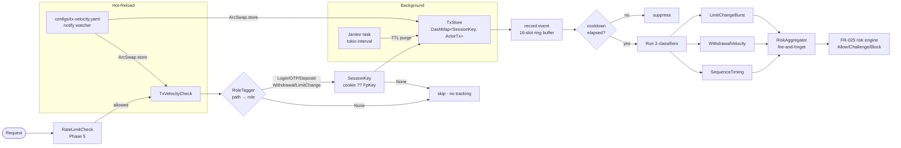

# Transaction Velocity & Sequence Detection (FR-012)

Operator guide for the cross-endpoint behavioral check that flags fintech-style
fraud patterns (rapid login→OTP→deposit, withdrawal bursts, limit-change
storms). Signal-only — never blocks directly. Risk aggregator decides the
final action.

> **Companion docs:** [request-pipeline.md](./request-pipeline.md) (where this
> check sits in the chain), [device-fingerprinting.md](./device-fingerprinting.md)
> (FR-010 — fallback identity source), [codebase-summary.md](./codebase-summary.md#transaction-velocity-anomaly-detection-fr-012).

---

## Overview

Single-request checks (rate limit, SQLi, scanner) miss fraud patterns that
unfold across **multiple endpoints over seconds-to-minutes**:

| Pattern | Why suspicious |
|---|---|
| `Login → OTP → Deposit` completed in <1.5s | Faster than a human; automated takeover |
| ≥5 withdrawals in 60s on one session | Cash-out automation after credential theft |
| ≥3 limit-change requests in 5 min | Pre-attack credential prep (raise transfer cap) |

FR-012 records the request stream per **session identity** (cookie or device
fingerprint), runs three classifiers on every record, and emits a
`Signal::TxSequenceTooFast` / `WithdrawalVelocity` / `LimitChangeBurst` to the
shared `RiskAggregator` (FR-025 plug-in point). The risk engine combines this
with FR-010/FR-011 signals and decides Allow / Challenge / Block.

**Module:** `crates/waf-engine/src/checks/tx_velocity/`
**Config:** `configs/tx-velocity.yaml` (hot-reloaded via `notify` + `ArcSwap`)
**Position in pipeline:** after Phase 5 (rate limit), before Phase 6 (scanner).

---

## Architecture



**Data flow:**
1. `TxVelocityCheck::check()` — entry point on the hot path. Returns `None`
   (signal-only).
2. `RoleTagger::classify(path)` — first-match-wins regex map. Unknown paths
   skip tracking.
3. `extract_session_key(ctx)` — cookie value preferred (configurable name);
   falls back to `FpKey` from FR-010 fingerprint pipeline.
4. `TxStore::record(key, Event)` — pushes onto a 16-slot `ArrayVec` ring,
   drops oldest on overflow. Updates `last_signal_ms` only when classifiers
   emit.
5. Classifier loop runs only when `now_ms - last_signal_ms ≥ cooldown_ms`.
6. Signals submitted to `Arc<dyn RiskAggregator>` via `tokio::spawn`
   (fire-and-forget — request path never blocks on aggregator).

---

## Configuration (`configs/tx-velocity.yaml`)

```yaml
tx_velocity:
  schema_version: 1
  enabled: false                   # flip to true to activate
  session_cookie: SESSIONID        # cookie name for session identity

  # Cooldown between emitting duplicate risk signals for the same session.
  signal_cooldown_ms: 5000

  # How long to retain transaction history per session.
  session_ttl_secs: 600

  # Janitor cleanup interval for expired sessions.
  janitor_period_secs: 60

  # Path → endpoint role mapping. First regex match wins.
  # Roles: login, otp, deposit, withdrawal, limit_change
  endpoint_roles:
    - role: login
      path: "^/api/v[0-9]+/auth/login$"
    - role: otp
      path: "^/api/v[0-9]+/auth/otp"
    - role: deposit
      path: "^/api/v[0-9]+/wallet/deposit$"
    - role: withdrawal
      path: "^/api/v[0-9]+/wallet/withdraw"
    - role: limit_change
      path: "^/api/v[0-9]+/account/limits"

  # Classifier parameters. Omit a block to disable that classifier.
  classifiers:
    sequence:
      min_human_ms: 1500           # Login→OTP→Deposit faster than this fires
    withdrawal_velocity:
      max_count: 5
      window_ms: 60000             # 5 withdrawals / 60s
    limit_change_velocity:
      max_count: 3
      window_ms: 300000            # 3 limit changes / 5 min
```

**Schema notes:**
- `enabled: false` (default) ⇒ subsystem inert; `Check::check()` is a no-op.
- Bad YAML retains the previous snapshot and logs `tracing::warn!`. The
  gateway never refuses to start because of a tx-velocity config error.
- Regexes compile once on load; recompile on hot-reload.

---

## Classifiers

### 1. `SequenceTimingClassifier`
Fires `Signal::TxSequenceTooFast { from, to, interval_ms }` when the latest
event closes a sensitive transition faster than `min_human_ms`. Tracked
transitions:
- `Login → OTP` (account takeover via stolen credentials + SIM-swap OTP)
- `OTP → Deposit` (immediate cash-in to legitimize the session)
- `Login → Deposit` (skipped MFA → likely cookie theft)

Only fires when the **latest event is the "to" role**. Prevents replay of
old transitions on every subsequent request.

### 2. `WithdrawalVelocityClassifier`
Counts `Withdrawal` events within `window_ms`; fires
`Signal::WithdrawalVelocity { count, window_sec }` when `count > max_count`.
Catches automated cash-out scripts.

### 3. `LimitChangeBurstClassifier`
Same shape as withdrawal velocity, but for `LimitChange` events. Detects
pre-attack credential prep where the attacker raises transfer / withdrawal
caps before draining funds.

**Cooldown:** Per-session `last_signal_ms` suppresses duplicate signals
within `signal_cooldown_ms` (default 5s). Prevents signal flooding (DoS
amplification on the aggregator).

---

## Tuning Guide

Conservative defaults minimize false positives. Tune per threat model.

| Parameter | Default | Tighter (more sensitive) | Looser (fewer FPs) |
|---|---|---|---|
| `sequence.min_human_ms` | 1500 | 800–1000 | 2500+ |
| `withdrawal_velocity.max_count` | 5 | 3 | 8–10 |
| `withdrawal_velocity.window_ms` | 60000 | 30000 | 120000 |
| `limit_change_velocity.max_count` | 3 | 2 | 5 |
| `signal_cooldown_ms` | 5000 | 2000 | 15000 |
| `session_ttl_secs` | 600 | 300 | 1800 |

**Tighten** when: high-fraud product (real-money fintech, gambling).
**Loosen** when: many legitimate power users with scripted workflows
(API clients, treasury bots).

**Empirically tune** by:
1. Enable with permissive thresholds + `RiskAggregator::Logging` (no action).
2. Watch `Signal::*` emission rate vs. confirmed-fraud labels for 1–2 weeks.
3. Adjust thresholds where false-positive rate exceeds tolerance.

---

## Risk-Score Interaction

This check is **signal-only**. Never returns a `DetectionResult` from
`Check::check()`. The risk engine (FR-025/27) is the sole arbiter:

```
TxVelocity → Signal → RiskAggregator → RiskEngine
                                          │
                                          ├─ score < challenge_threshold → Allow
                                          ├─ score ≥ challenge_threshold → Challenge (CAPTCHA)
                                          └─ score ≥ block_threshold → Block (403)
```

Signal severity deltas (suggested for FR-025 wiring):

| Signal | Default delta |
|---|---|
| `TxSequenceTooFast` | +15 |
| `WithdrawalVelocity` | +10 |
| `LimitChangeBurst` | +10 |

Composition with FR-010 (device-fp) + FR-011 (behavioral) signals lets the
risk engine require **multiple weak signals** before challenging — reduces
false positives vs. a single classifier acting alone.

---

## Performance

Benchmarks on Apple Silicon (Criterion, see
[`bench-results.md`](../plans/260504-1632-fr-012-transaction-velocity/bench-results.md)):

| Path | Latency |
|---|---|
| `record()` existing session + classifier eval (hot path) | ~94 ns |
| `record()` new session (cold path, allocation) | ~1.5 µs |
| Scaling — 50k populated sessions | ~253 ns (constant via DashMap shards) |
| 4-thread concurrent (400 ops total) | ~109 µs (~273 ns/op amortized) |

Budget: p99 < 100 µs/request — exceeded by ~1000×. Hot path is alloc-free
after the first record per session.

---

## Limitations

| Limitation | Impact | Workaround / Future fix |
|---|---|---|
| **Per-node state** (DashMap, not shared) | Cluster: same session hitting different WAF nodes splits its event stream | Assume session-affinity at the LB; or ship Redis-backed `TxStore` (post-v0.2) |
| **`ok = true` always** at request entry | Failed-login signal not captured (no response phase hook yet) | Phase 6 follow-up: response-side enrichment |
| **Cookie-based identity primary** | Bots without cookies still tracked via FpKey, but anonymous traffic without either is skipped | Acceptable — anonymous traffic is rate-limit's job |
| **Regex roles only** | Hard to express "all `/api/v*/wallet/*`" without explicit list | First-match-wins; YAML supports any number of rules |

---

## Operational Runbook

### Enabling on production

1. Edit `configs/tx-velocity.yaml`: `enabled: true`, audit `endpoint_roles`
   regexes against your real API surface.
2. Save — hot-reload picks it up within ~1s. Watch the WAF log for:
   ```
   tx_velocity: initial config loaded
   ```
3. Generate synthetic traffic (e.g., `curl /api/v1/auth/login` then
   `/api/v1/auth/otp` rapidly) and confirm signals appear in the aggregator
   sink (logs / Prometheus / your FR-025 backend).
4. If no signals fire on known-bad traffic, check:
   - Cookie name matches your backend (`session_cookie`)
   - Path regexes match (test with `cargo test -p waf-engine role_tagger`)
   - `enabled: true` and the YAML loaded without parse errors

### Disabling fast

Either:
- Set `enabled: false` and save (hot-reload, ~1s)
- Delete `configs/tx-velocity.yaml` (subsystem inert on next reload)

The check trait runs only when config is `enabled: true`, so the hot path
becomes a single atomic `ArcSwap` load + branch.

### Memory bound

`TxStore` is bounded by:
- Sessions: `session_ttl_secs` × peak unique sessions/sec — purged by janitor
- Per session: `ArrayVec<Event, 16>` ≈ 256 B + DashMap overhead

10k concurrent sessions ≈ 2.5 MB. The janitor scan is `O(n)` over the
DashMap; with `janitor_period_secs: 60` this is negligible.

---

## Testing

| Layer | File | Coverage |
|---|---|---|
| Unit | `src/checks/tx_velocity/role_tagger.rs` | 4 tests |
| Unit | `src/checks/tx_velocity/recorder.rs` | 12 tests |
| Unit | `src/checks/tx_velocity/classifiers/*.rs` | 15 tests (6+5+4) |
| Integration | `tests/tx_velocity_integration.rs` | 9 tests (full pipeline + mock aggregator) |
| Bench | `benches/tx_velocity_bench.rs` | 6 Criterion benchmarks |

Run all: `cargo test -p waf-engine tx_velocity`
Run benches: `cargo bench -p waf-engine --bench tx_velocity_bench`

---

## Related Docs

- [request-pipeline.md](./request-pipeline.md) — full 16-phase pipeline; this check sits at Phase 5.5.
- [device-fingerprinting.md](./device-fingerprinting.md) — FR-010, fallback identity source.
- [codebase-summary.md](./codebase-summary.md#transaction-velocity-anomaly-detection-fr-012) — module bullet + crate map.
- [project-roadmap.md](./project-roadmap.md) — release status.
- Plan: [`plans/260504-1632-fr-012-transaction-velocity/`](../plans/260504-1632-fr-012-transaction-velocity/)
